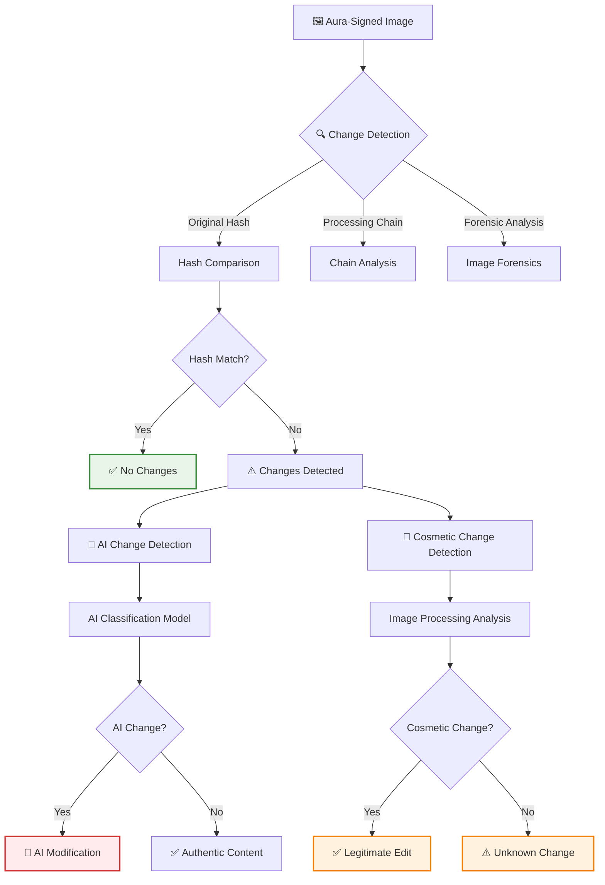

# 🔍 AI vs Cosmetic Change Detection: Classification and Verification

<div align="center">

**Advanced detection and classification of AI-generated modifications versus legitimate cosmetic edits in verified images**

[](https://github.com/yourusername/aura)
[](https://github.com/yourusername/aura)
[](https://github.com/yourusername/aura)

</div>

---

## 🎯 Executive Summary

Aura not only verifies image authenticity but also **classifies the type of changes** made to verified images. This system distinguishes between:

1. **AI-Generated Changes**: Content synthesized by AI models (objects added/removed, scenes generated, deepfakes)
2. **Cosmetic Changes**: Legitimate edits that enhance or adjust authentic content (color correction, brightness, cropping, filters)

This classification is critical because:
- **AI changes** fundamentally alter the truthfulness of the image
- **Cosmetic changes** preserve the core authentic content while enhancing presentation
- Different use cases have different tolerance levels for each type

---

## 🏗️ Technical Architecture

### Change Detection Pipeline



---

## 🔬 Detection Methodologies

### 1. Cryptographic Hash Comparison

**Principle**: Compare current image hash with original signed hash

```python
# Pseudocode
def detect_hash_mismatch(image, original_signature):
    current_hash = sha256_hash(image.pixel_data)
    original_hash = original_signature.image_hash
    
    if current_hash == original_hash:
        return ChangeResult(has_changes=False)
    
    # Hash mismatch indicates changes
    return ChangeResult(has_changes=True, needs_classification=True)
```

**Advantages**:
- Instant detection of any pixel-level changes
- 100% accurate for detecting changes
- Cannot be bypassed without breaking signature

**Limitations**:
- Doesn't classify change type (requires additional analysis)
- False positives for lossy compression (if not handled)

### 2. Processing Chain Analysis

**Principle**: Analyze the signed processing chain for legitimate vs suspicious operations

```python
# Processing chain structure
processing_chain = {
    "steps": [
        {"operation": "demosaicing", "signed": true, "legitimate": true},
        {"operation": "noise_reduction", "signed": true, "legitimate": true},
        {"operation": "color_correction", "signed": true, "legitimate": true},
        {"operation": "ai_object_insertion", "signed": false, "legitimate": false},  # RED FLAG
        {"operation": "brightness_adjustment", "signed": false, "legitimate": true}
    ]
}
```

**Legitimate Operations** (Cosmetic):
- Demosaicing, noise reduction, color correction
- Brightness/contrast adjustments
- Cropping, rotation, scaling
- Sharpening, blur effects
- Format conversion

**Suspicious Operations** (AI):
- AI object insertion/removal
- Deepfake face swapping
- Scene generation
- Style transfer (if altering content)
- Inpainting/outpainting

### 3. Image Forensic Analysis

#### A. Pixel-Level Analysis

**Detecting AI Generation Artifacts**:
- **Frequency Domain**: AI images often have unnatural frequency patterns
- **Compression Artifacts**: Inconsistent compression patterns
- **Color Statistics**: Unusual color distributions
- **Noise Patterns**: Synthetic noise characteristics

```python
def analyze_image_forensics(image):
    # DCT (Discrete Cosine Transform) analysis
    dct_coefficients = compute_dct(image)
    ai_probability = dct_ai_classifier(dct_coefficients)
    
    # Color histogram analysis
    color_stats = analyze_color_distribution(image)
    color_anomaly_score = detect_color_anomalies(color_stats)
    
    # Noise analysis
    noise_pattern = extract_noise_pattern(image)
    noise_ai_score = classify_noise_pattern(noise_pattern)
    
    return ForensicResult(
        ai_probability=weighted_average([ai_probability, color_anomaly_score, noise_ai_score]),
        confidence=calculate_confidence()
    )
```

#### B. Semantic Content Analysis

**Detecting Semantic Inconsistencies**:
- **Object Placement**: Objects in physically impossible positions
- **Lighting Consistency**: Inconsistent lighting across scene
- **Reflection Analysis**: Mirrors/reflections not matching scene
- **Perspective Analysis**: Perspective inconsistencies

```python
def semantic_content_analysis(image):
    # Object detection and placement analysis
    objects = detect_objects(image)
    placement_consistency = check_placement_consistency(objects)
    
    # Lighting analysis
    lighting_model = estimate_lighting(image)
    lighting_consistency = check_lighting_consistency(lighting_model)
    
    # Reflection analysis
    reflections = detect_reflections(image)
    reflection_consistency = check_reflection_consistency(reflections, objects)
    
    return SemanticResult(
        inconsistency_score=calculate_inconsistency(
            placement_consistency,
            lighting_consistency,
            reflection_consistency
        ),
        likely_ai_generated=inconsistency_score > threshold
    )
```

### 4. Machine Learning Classification

**Deep Learning Models for Change Classification**:

```python
class ChangeClassificationModel:
    """
    Multi-class classifier distinguishing:
    - No changes
    - Cosmetic changes only
    - AI-generated changes
    - Mixed changes
    """
    
    def __init__(self):
        self.ai_detector = AIGeneratedContentDetector()
        self.cosmetic_classifier = CosmeticChangeClassifier()
        self.region_analyzer = RegionChangeAnalyzer()
    
    def classify_changes(self, original_image, modified_image, signature):
        # Extract features
        original_features = self.extract_features(original_image)
        modified_features = self.extract_features(modified_image)
        
        # Compare regions
        diff_mask = self.compute_diff_mask(original_image, modified_image)
        changed_regions = self.identify_changed_regions(diff_mask)
        
        # Classify each region
        results = []
        for region in changed_regions:
            region_original = extract_region(original_image, region)
            region_modified = extract_region(modified_image, region)
            
            # AI detection
            ai_score = self.ai_detector.detect(region_modified)
            
            # Cosmetic analysis
            cosmetic_score = self.cosmetic_classifier.analyze(
                region_original, 
                region_modified
            )
            
            results.append({
                "region": region,
                "ai_probability": ai_score,
                "cosmetic_probability": cosmetic_score,
                "classification": self.classify_region(ai_score, cosmetic_score)
            })
        
        # Aggregate results
        return self.aggregate_classifications(results)
```

---

## 📊 Classification Framework

### Change Categories

| Category | Description | Examples | Authenticity Impact |
|----------|-------------|----------|---------------------|
| **No Changes** | Image matches original hash | Original unmodified image | ✅ Fully Authentic |
| **Cosmetic Only** | Only enhancement/processing changes | Color correction, brightness, filters | ✅ Authentic (Enhanced) |
| **AI Insertion** | AI-generated objects/scenes added | Added person, object, background | ❌ Not Authentic |
| **AI Removal** | Objects removed via AI inpainting | Removed person, object | ❌ Not Authentic |
| **AI Modification** | Existing content AI-modified | Face swap, style transfer altering content | ❌ Not Authentic |
| **Mixed** | Combination of cosmetic and AI | Color correction + AI object addition | ❌ Not Authentic |

### Verification Levels with Changes

```python
class VerificationResult:
    def __init__(self):
        self.authentic = False
        self.verification_level = None
        self.change_detection = ChangeDetection()
    
    def calculate_verification_level(self):
        if not self.change_detection.has_changes:
            return VerificationLevel.HARDWARE_ATTESTED
        
        if self.change_detection.has_ai_changes:
            return VerificationLevel.AI_MODIFIED
        
        if self.change_detection.has_only_cosmetic_changes:
            return VerificationLevel.AUTHENTIC_WITH_ENHANCEMENTS
        
        return VerificationLevel.UNKNOWN_CHANGES
```

---

## 🔍 Detailed Detection Techniques

### AI Change Detection

#### 1. Generative Model Fingerprints

Different AI models leave characteristic fingerprints:

```python
def detect_generative_fingerprints(image):
    """
    Detect fingerprints of common AI models:
    - Midjourney: Distinctive color patterns
    - DALL-E: Specific frequency domain signatures
    - Stable Diffusion: Characteristic noise patterns
    - GAN models: Known artifacts
    """
    fingerprints = {
        "midjourney": detect_midjourney_patterns(image),
        "dalle": detect_dalle_patterns(image),
        "stable_diffusion": detect_sd_patterns(image),
        "gan": detect_gan_artifacts(image)
    }
    
    return max(fingerprints.items(), key=lambda x: x[1])
```

#### 2. Deepfake Detection (Faces)

```python
class DeepfakeDetector:
    def detect_face_swap(self, image):
        faces = face_detection(image)
        results = []
        
        for face in faces:
            # Face alignment analysis
            alignment_score = analyze_face_alignment(face)
            
            # Blink detection (deepfakes often have unnatural blinking)
            blink_pattern = analyze_blink_pattern(face)
            
            # Micro-expression analysis
            micro_expressions = analyze_micro_expressions(face)
            
            # Color consistency
            skin_tone_consistency = analyze_skin_tone_consistency(face, image)
            
            deepfake_probability = self.combine_scores(
                alignment_score,
                blink_pattern,
                micro_expressions,
                skin_tone_consistency
            )
            
            results.append({
                "face_region": face.bounding_box,
                "deepfake_probability": deepfake_probability,
                "is_deepfake": deepfake_probability > 0.85
            })
        
        return results
```

#### 3. Inpainting/Outpainting Detection

```python
def detect_inpainting(image):
    """
    Detect areas where content was filled in (inpainting)
    or extended (outpainting)
    """
    # Edge detection around suspicious regions
    edges = detect_edges(image)
    suspicious_regions = find_inconsistent_edge_patterns(edges)
    
    # Frequency domain analysis
    fft_image = fft2(image)
    frequency_patterns = analyze_frequency_patterns(fft_image)
    
    # Texture consistency
    texture_map = analyze_texture_consistency(image)
    texture_anomalies = find_texture_anomalies(texture_map)
    
    # Combine evidence
    inpainting_regions = intersect_regions(
        suspicious_regions,
        frequency_patterns.anomalous_regions,
        texture_anomalies
    )
    
    return InpaintingResult(
        has_inpainting=len(inpainting_regions) > 0,
        regions=inpainting_regions,
        confidence=calculate_confidence()
    )
```

### Cosmetic Change Detection

#### 1. Color Space Transformations

```python
def detect_color_adjustments(original, modified):
    """
    Detect legitimate color adjustments:
    - HSV adjustments (hue, saturation, value)
    - RGB curves
    - Color grading
    - White balance corrections
    """
    # Convert to HSV
    original_hsv = rgb_to_hsv(original)
    modified_hsv = rgb_to_hsv(modified)
    
    # Analyze transformations
    hue_shift = calculate_hue_shift(original_hsv, modified_hsv)
    saturation_change = calculate_saturation_change(original_hsv, modified_hsv)
    value_change = calculate_value_change(original_hsv, modified_hsv)
    
    # Check if transformation is global (cosmetic) vs local (potentially AI)
    if is_global_transformation(hue_shift, saturation_change, value_change):
        return ChangeType.COSMETIC_COLOR_ADJUSTMENT
    
    return ChangeType.UNKNOWN
```

#### 2. Geometric Transformations

```python
def detect_geometric_changes(original, modified):
    """
    Detect legitimate geometric transformations:
    - Rotation, translation, scaling
    - Cropping
    - Perspective correction
    """
    # Feature matching
    features_original = extract_features(original)
    features_modified = extract_features(modified)
    
    matches = match_features(features_original, features_modified)
    
    # Estimate transformation
    transform = estimate_transform(matches)
    
    # Check if transformation is uniform (cosmetic)
    if is_uniform_transform(transform):
        return ChangeType.COSMETIC_GEOMETRIC
    
    return ChangeType.UNKNOWN
```

#### 3. Filter Effects

```python
def detect_filter_effects(original, modified):
    """
    Detect common filter effects:
    - Blur, sharpening
    - Noise reduction
    - Artistic filters
    """
    # Frequency domain analysis
    original_fft = fft2(original)
    modified_fft = fft2(modified)
    
    # Check for high-pass or low-pass filtering
    if is_filter_application(original_fft, modified_fft):
        filter_type = classify_filter(original_fft, modified_fft)
        return ChangeType.COSMETIC_FILTER, filter_type
    
    return ChangeType.UNKNOWN
```

---

## 🎯 Use Case Classifications

### Journalism and News

**Tolerance**:
- ✅ Cosmetic: High tolerance (color correction, cropping)
- ❌ AI Changes: Zero tolerance

**Verification Standard**:
- Must be hardware-attested
- No AI modifications allowed
- Cosmetic changes must be documented

### Legal Evidence

**Tolerance**:
- ✅ Cosmetic: Minimal (only exposure correction)
- ❌ AI Changes: Zero tolerance

**Verification Standard**:
- Hardware-attested required
- Minimal to no cosmetic changes
- Complete audit trail required

### Social Media

**Tolerance**:
- ✅ Cosmetic: High tolerance (filters, enhancements)
- ⚠️ AI Changes: Depends on disclosure

**Verification Standard**:
- Software-attested acceptable
- AI changes must be disclosed
- Cosmetic changes allowed freely

### Scientific Documentation

**Tolerance**:
- ✅ Cosmetic: Minimal (only calibration)
- ❌ AI Changes: Zero tolerance

**Verification Standard**:
- Hardware-attested preferred
- Cosmetic changes must be documented
- No AI modifications

---

## 📈 Change Detection API

### Verification Response with Change Detection

```json
{
    "authentic": true,
    "verification_level": "hardware_attested",
    "device_id": "AURA-DEV-12345",
    "timestamp": "2025-01-15T10:30:00Z",
    "change_detection": {
        "has_changes": true,
        "change_type": "cosmetic_only",
        "ai_changes": {
            "detected": false,
            "probability": 0.02,
            "regions": []
        },
        "cosmetic_changes": {
            "detected": true,
            "types": [
                {
                    "type": "color_adjustment",
                    "regions": ["full_image"],
                    "parameters": {
                        "brightness": +0.1,
                        "contrast": +0.05,
                        "saturation": +0.08
                    }
                },
                {
                    "type": "sharpening",
                    "regions": ["full_image"],
                    "intensity": "low"
                }
            ]
        },
        "confidence": 0.95
    }
}
```

---

## 🔮 Future Enhancements

### Advanced AI Detection

1. **Multi-Model Ensemble**: Combining multiple AI detection models
2. **Temporal Analysis**: Video change detection across frames
3. **Source Attribution**: Identifying specific AI model used
4. **Real-Time Detection**: Edge deployment for instant detection

### Cosmetic Change Documentation

1. **Edit History**: Complete record of all cosmetic edits
2. **Parameter Extraction**: Exact parameters used for each edit
3. **Reversibility**: Ability to reverse cosmetic changes
4. **Edit Verification**: Cryptographic verification of edit chain

---

<div align="center">

## Classifying Change Types for Authentic Verification

**By distinguishing AI-generated modifications from legitimate cosmetic enhancements, Aura provides nuanced verification that reflects the reality of modern image processing while maintaining trust in authentic content.**

*Last updated: January 2025*

</div>
