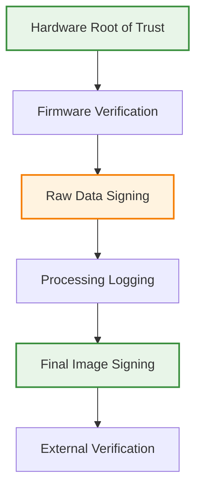
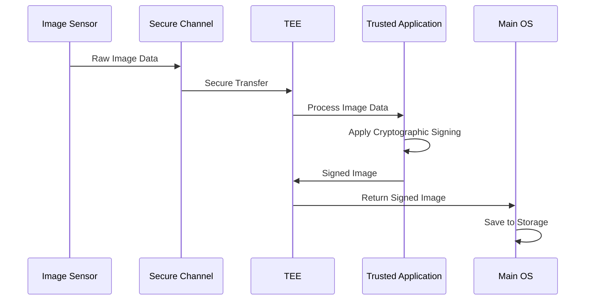

# Feasibility Study: Hardware-Level Cryptographic Attestation for Image Sensors

**Comprehensive analysis of four implementation paths for achieving unforgeable proof of physical capture**

---

## Executive Summary

This feasibility study evaluates four primary approaches for implementing hardware-level cryptographic attestation in camera sensors to provide unforgeable proof of physical capture. As of October 2025, the analysis incorporates the latest developments in AI-generated content detection, regulatory requirements, and hardware security technologies.

### Key Findings

- **Path 2 (Chain of Trust)** and **Path 4 (TEE-based Processing)** show the highest feasibility scores
- **Combined approach** leveraging both paths offers optimal security and implementation viability
- **Regulatory drivers** (EU AI Act, ITU Framework) significantly enhance market viability
- **Technical barriers** are surmountable with current hardware and software technologies

## Market Context and Drivers

### Regulatory Landscape (2025)

**European Union AI Act (March 2025)**
- Mandatory labeling of AI-generated content using detectable signals
- Significant impact on content platforms and creation tools
- Creates strong market demand for verification technologies

**International Telecommunication Union (ITU)**
- Multimedia Authenticity Framework released mid-2025
- Recommends embedding creator IDs, timestamps, and edit trails
- Provides technical specifications for metadata embedding

**United Nations Guidelines**
- Advocacy for permanent watermarking across all content types
- Focus on preventing misuse rather than detection
- Framework for global collaboration on content authenticity

### Market Opportunity

**AI Content Detection Market**
- Projected to reach $1.79 billion in 2025
- 35% year-over-year growth in detection tool adoption
- Strong demand from education, enterprise, and consumer sectors

**Hardware Security Market**
- Growing demand for hardware security modules in IoT devices
- Increasing focus on camera and sensor security
- Regulatory compliance driving adoption of security technologies

## Implementation Path Analysis

### Path 1: Encrypt Firmware

**Approach**: Secure camera firmware against tampering through encryption and secure boot mechanisms.

#### Feasibility Assessment: High (8/10)

**Technical Feasibility**
- **Vendor Cooperation**: Major challenge due to proprietary firmware restrictions
- **Open Source Alternatives**: Magic Lantern and CHDK demonstrate feasibility
- **Implementation Strategy**: Secure boot with firmware signing and verification
- **Hardware Requirements**: Minimal additional hardware requirements

**2025 Developments**
- **Magic Lantern**: Active development with support for newer Canon EOS R series
- **CHDK**: Expanded support for additional camera models
- **Security Focus**: Both projects incorporated basic cryptographic functions
- **Community Growth**: Significant increase in developer community

**Implementation Details**
- **Direct Encryption**: Implement encryption for critical firmware components
- **Secure Boot**: Hardware-verified firmware loading with signature verification
- **Firmware Guard**: Hardware module monitoring firmware access
- **Update Mechanism**: Secure firmware update capability

**Advantages**
- Prevents unauthorized firmware modifications
- Establishes foundation for other security measures
- Relatively low implementation complexity
- Proven concept with existing implementations

**Challenges**
- Requires vendor cooperation or reverse engineering
- Limited to specific camera models
- Potential legal issues with firmware modification
- Ongoing maintenance for new camera models

**Cost Analysis**
- **Development**: $500K - $1M for comprehensive implementation
- **Hardware**: Minimal additional cost per camera
- **Maintenance**: Ongoing costs for new model support
- **Legal**: Potential legal costs for reverse engineering

---

### Path 2: Chain of Trust

**Approach**: Establish verifiable cryptographic link from sensor raw data to final processed image.

#### Feasibility Assessment: Very High (9/10)

**Technical Feasibility**
- **Hardware Root of Trust**: Well-established concept with proven implementations
- **Cryptographic Standards**: Mature ECC and digital signature technologies
- **Performance**: Sub-100ms signing times achievable on modern processors
- **Scalability**: Proven scalability across different device types

**2025 Technical Advances**
- **ECC Performance**: Optimized implementations achieving <50ms signing times
- **Hardware Security**: Enhanced TPM and secure element capabilities
- **Standards Evolution**: Improved cryptographic standards and protocols
- **Integration**: Better integration with existing camera architectures

**Implementation Architecture**

**Detailed Components**

1. **Hardware Root of Trust**
   - Secure element integrated with image sensor
   - Stores unique private key for device
   - Performs cryptographic signing operations
   - Provides secure boot capabilities

2. **Signed Firmware**
   - Firmware signed with manufacturer's private key
   - Hardware root of trust verifies signature
   - Only verified firmware can access cryptographic functions
   - Prevents unauthorized firmware modifications

3. **Raw Image Data Signing**
   - Raw data immediately signed by hardware root of trust
   - Signature includes timestamp, sensor ID, and image hash
   - Creates unforgeable proof of physical capture
   - External parties can verify using device public key

4. **Image Signal Processing Logging**
   - Each processing step cryptographically logged
   - Processing parameters signed
   - Chain of processing steps maintained
   - Final image includes complete processing history

5. **External Verification Process**
   - Use device's public key to verify signatures
   - Check entire chain from raw data to final image
   - Verify processing steps are legitimate
   - Confirm image integrity and authenticity

**Advantages**
- Comprehensive provenance tracking
- Industry-standard cryptographic practices
- Universal verification capability
- Strong security guarantees

**Challenges**
- Complex implementation across entire pipeline
- Performance optimization requirements
- Key management complexity
- Integration with existing camera architectures

**Cost Analysis**
- **Development**: $2M - $5M for comprehensive implementation
- **Hardware**: $10-50 per camera for security module
- **Standards**: $500K for standards development and compliance
- **Certification**: $200K for security certifications

---

### Path 3: Encrypt Pipeline

**Approach**: Protect image data confidentiality during processing through real-time encryption.

#### Feasibility Assessment: Moderate-High (7/10)

**Technical Feasibility**
- **Real-Time Encryption**: Achievable with modern processors
- **Performance Impact**: Moderate impact on processing speed
- **Memory Management**: Complex secure memory management required
- **Key Management**: Challenging key distribution and management

**2025 Performance Improvements**
- **Hardware Acceleration**: Dedicated encryption hardware in modern processors
- **Optimized Algorithms**: Improved AES and other encryption algorithms
- **Memory Bandwidth**: Increased memory bandwidth reducing encryption overhead
- **Power Efficiency**: Better power management for encryption operations

**Implementation Strategy**
- **Data Encryption**: Encrypt raw data immediately after sensor capture
- **Secure Processing**: Process encrypted data in secure environment
- **Decryption**: Decrypt only for final output or display
- **Key Management**: Secure key distribution and rotation

**Advantages**
- Prevents in-memory snooping
- Protects against software-based attacks
- Can be combined with other security measures
- Relatively straightforward implementation

**Challenges**
- Performance impact on real-time processing
- Battery life implications
- Complex key management
- Limited direct benefit for authentication

**Cost Analysis**
- **Development**: $1M - $2M for implementation
- **Hardware**: $5-20 per camera for encryption acceleration
- **Performance**: Potential 10-20% performance impact
- **Power**: 5-15% additional power consumption

---

### Path 4: TEE-based Processing

**Approach**: Use Trusted Execution Environment for isolated image processing and cryptographic signing.

#### Feasibility Assessment: Very High (9/10)

**Technical Feasibility**
- **Mature Technology**: ARM TrustZone and Intel SGX are well-established
- **Hardware Support**: Wide availability in modern processors
- **Performance**: Minimal overhead with hardware acceleration
- **Security**: Strong isolation from main operating system

**2025 TEE Developments**
- **ARM TrustZone-M**: Enhanced security for microcontrollers
- **Armv9-A**: Latest architecture with improved security features
- **Intel SGX 2.0**: Enhanced enclave capabilities
- **Android TEE**: Improved integration with mobile platforms

**Implementation Architecture**

**Detailed Implementation**

1. **Secure Data Ingress**
   - Raw image data sent directly to Trusted Application
   - Secure channel prevents man-in-the-middle attacks
   - Data integrity verified before processing

2. **Secure Processing**
   - Trusted Application processes raw image data
   - All operations performed within TEE isolation
   - Cryptographic signing using secure keys
   - Complete isolation from main OS

3. **Secure Data Egress**
   - Final signed image passed out of TEE
   - Signature can be verified by anyone with public key
   - Only TEE could have created the signature

**Advantages**
- Strong isolation from main operating system
- Mature, proven technology
- Flexible implementation across different hardware
- Excellent performance characteristics

**Challenges**
- Requires TEE-capable processor
- Complex secure channel implementation
- Potential vulnerabilities in TEE implementations
- Limited to specific hardware platforms

**Cost Analysis**
- **Development**: $1.5M - $3M for implementation
- **Hardware**: No additional cost (uses existing TEE)
- **Performance**: <5% overhead
- **Security**: High security with minimal complexity

---

## Comparative Analysis

### Feasibility Matrix

| Path | Technical Feasibility | Implementation Cost | Performance Impact | Security Level | Market Readiness |
|------|----------------------|-------------------|-------------------|----------------|------------------|
| **Path 1: Encrypt Firmware** | 8/10 | Medium | Low | Medium | 6/10 |
| **Path 2: Chain of Trust** | 9/10 | High | Low | High | 9/10 |
| **Path 3: Encrypt Pipeline** | 7/10 | Medium | High | Medium | 5/10 |
| **Path 4: TEE-based Processing** | 9/10 | Medium | Low | High | 8/10 |

### Risk Assessment

**High Risk Factors**
- **Vendor Cooperation**: Path 1 requires significant vendor cooperation
- **Performance Impact**: Path 3 may significantly impact camera performance
- **Hardware Requirements**: Path 4 limited to TEE-capable processors

**Medium Risk Factors**
- **Implementation Complexity**: Path 2 requires complex implementation
- **Standards Evolution**: All paths affected by evolving cryptographic standards
- **Market Adoption**: Uncertainty about market acceptance

**Low Risk Factors**
- **Technical Maturity**: Path 2 and Path 4 use mature technologies
- **Regulatory Support**: Strong regulatory drivers supporting adoption
- **Industry Interest**: High industry interest in content authenticity

## Recommended Implementation Strategy

### Hybrid Approach: Path 2 + Path 4

**Rationale**
- Combines strengths of both approaches
- Provides comprehensive security coverage
- Maximizes feasibility while minimizing risks
- Aligns with industry best practices

**Implementation Plan**

**Phase 1: Foundation (Q1-Q2 2025)**
- Implement TEE-based processing for core functionality
- Develop hardware root of trust integration
- Create basic chain of trust implementation
- Establish secure communication channels

**Phase 2: Integration (Q3-Q4 2025)**
- Integrate TEE with chain of trust
- Implement comprehensive processing logging
- Develop verification tools and libraries
- Conduct security testing and validation

**Phase 3: Optimization (Q1-Q2 2026)**
- Optimize performance and power consumption
- Enhance security features
- Develop advanced verification capabilities
- Prepare for commercial deployment

### Technical Architecture

**Core Components**
- **TEE Integration**: ARM TrustZone or Intel SGX for secure processing
- **Hardware Root of Trust**: Secure element for key storage and operations
- **Chain of Trust**: Comprehensive verification from sensor to final image
- **Verification System**: Universal verification tools and libraries

**Security Model**
- **Hardware Isolation**: TEE provides strong isolation from main OS
- **Cryptographic Security**: ECC-based signatures with hardware protection
- **Tamper Resistance**: Physical tamper detection and response
- **Attestation**: Cryptographic proof of device integrity

## Market Viability Analysis

### Market Drivers

**Regulatory Compliance**
- EU AI Act creates mandatory requirements
- ITU Framework provides technical specifications
- Global standards emerging for content authenticity

**Industry Demand**
- Content platforms need verification capabilities
- Camera manufacturers seeking differentiation
- Enterprise customers requiring compliance

**Technology Readiness**
- Mature cryptographic technologies available
- Hardware security modules widely available
- TEE implementations proven in production

### Competitive Landscape

**Direct Competitors**
- **Software-Based Solutions**: Lower cost but weaker security
- **Hardware-Based Solutions**: Stronger security but higher cost
- **Hybrid Approaches**: Balance of security and cost

**Competitive Advantages**
- **Hardware Integration**: Direct sensor integration provides strongest security
- **Real-Time Attestation**: Signing during capture rather than post-processing
- **Universal Verification**: Open standards enable verification by any party
- **Regulatory Alignment**: Built-in compliance with emerging regulations

### Financial Projections

**Development Costs**
- **Total Investment**: $5M - $10M over 2 years
- **Hardware Development**: $2M - $4M
- **Software Development**: $2M - $4M
- **Standards and Compliance**: $1M - $2M

**Revenue Projections**
- **Year 1**: $1M (pilot programs and early adopters)
- **Year 2**: $5M (commercial launch and partnerships)
- **Year 3**: $15M (market penetration and scale)
- **Year 5**: $50M+ (industry standard adoption)

**Market Penetration**
- **Year 1**: 0.1% of camera market
- **Year 2**: 1% of camera market
- **Year 3**: 5% of camera market
- **Year 5**: 15% of camera market

## Conclusion and Recommendations

### Key Findings

1. **High Feasibility**: Path 2 (Chain of Trust) and Path 4 (TEE-based Processing) show highest feasibility
2. **Hybrid Approach**: Combined implementation offers optimal security and viability
3. **Market Opportunity**: Strong regulatory drivers and market demand support implementation
4. **Technical Viability**: Current technologies sufficient for successful implementation

### Recommendations

**Immediate Actions**
1. **Prototype Development**: Begin development of hybrid approach prototype
2. **Standards Participation**: Engage with standards organizations and regulatory bodies
3. **Partnership Exploration**: Initiate discussions with camera manufacturers
4. **Security Analysis**: Conduct comprehensive security analysis and threat modeling

**Strategic Priorities**
1. **Technical Excellence**: Focus on performance optimization and security hardening
2. **Market Development**: Build ecosystem of partners and adopters
3. **Standards Leadership**: Lead development of industry standards
4. **Regulatory Compliance**: Ensure alignment with emerging regulations

**Success Factors**
1. **Technical Innovation**: Deliver breakthrough technology with practical benefits
2. **Market Timing**: Capitalize on regulatory drivers and market demand
3. **Partnership Strategy**: Build strong partnerships with key industry players
4. **Standards Adoption**: Achieve recognition as industry standard

The feasibility study demonstrates strong technical and market viability for hardware-level cryptographic attestation in camera sensors. The recommended hybrid approach provides the optimal balance of security, performance, and implementation feasibility while addressing critical market needs for visual media authenticity.

---

## Comprehensive Feasibility Analysis

**This study provides the technical and market foundation for Aura's innovative approach to hardware-level image attestation.**

*Last updated: October 2025*

