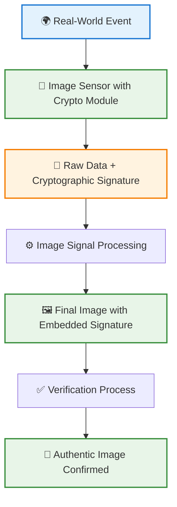

# 💡 Project Idea: Unforgeable Proof of Physical Capture

**A groundbreaking approach to authenticating digital images through hardware-level cryptographic attestation**

---

## 🎯 Executive Summary

The proliferation of advanced generative AI models presents a **critical societal challenge**: the erosion of trust in visual media. The ability to generate photorealistic images and videos of events that never occurred undermines the integrity of legal evidence, journalism, scientific documentation, and even personal memories.

**Aura** proposes a novel solution by implementing public key cryptography directly at the image sensor level. By embedding cryptographic signing capabilities into camera sensors (CMOS/CCD), we can authenticate images at the moment of capture, creating a verifiable and unforgeable "proof of physical capture."

## 🚨 Problem Statement

### The Crisis of Visual Authenticity

In 2025, we face an unprecedented challenge where **photorealistic synthetic media is indistinguishable from authentic content**. This creates a fundamental threat to:

| Domain | Impact | Example Scenarios |
|--------|--------|-------------------|
| **🏛️ Legal System** | Evidence admissibility questioned | Court cases dismissed due to potential deepfake evidence |
| **📰 Journalism** | Credibility crisis in media | Authentic footage indistinguishable from propaganda |
| **🔬 Scientific Research** | Data integrity compromised | Visual data manipulation in peer-reviewed studies |
| **👨‍👩‍👧‍👦 Personal Records** | Historical uncertainty | Family photos potentially AI-generated |
| **🏢 Corporate Communications** | Brand reputation at risk | Fake corporate announcements and product images |

### Limitations of Current Solutions

Existing approaches have fundamental weaknesses:

- **❌ Software Watermarks**: Easily removed or forged
- **❌ Metadata Analysis**: Can be stripped or manipulated
- **❌ Post-Capture Signatures**: Applied after image creation, vulnerable to tampering
- **❌ Blockchain Timestamps**: Don't prove physical capture occurred
- **❌ AI Detection Tools**: Constantly playing catch-up with advancing AI capabilities

**We need a solution that operates as close to the source of reality as possible.**

## 💡 Proposed Solution

### Core Innovation: Hardware-Level Cryptographic Attestation

This research explores the feasibility of integrating cryptographic primitives directly into the hardware of image sensors. Our approach involves:

### 🔧 Technical Components

- **🔐 Hardware-Integrated Crypto Primitives**: Designing and implementing cryptographic functions within the sensor's firmware or dedicated hardware modules
- **🛡️ Tamper-Resistant Key Storage**: Securely storing cryptographic keys on the sensor to prevent extraction or modification
- **⚡ Real-Time Signing**: Developing a process for signing image data in real-time with minimal impact on camera performance
- **🔗 Chain of Trust**: Establishing a verifiable cryptographic link from photon capture to final image output

### 🎯 Key Advantages

| Advantage | Description | Impact |
|-----------|-------------|---------|
| **🔒 Hardware-Level Security** | Cryptographic operations performed at sensor level | Cannot be bypassed by software attacks |
| **⚡ Real-Time Attestation** | Images signed during capture, not after | Prevents post-capture tampering |
| **🛡️ Tamper-Resistant** | Physical modification required to compromise | Extremely difficult to forge |
| **🌐 Universal Verification** | Anyone can verify with public keys | No proprietary verification needed |
| **📱 Future-Proof** | Compatible with existing and future technologies | Long-term viability |

### 🏗️ Implementation Architecture

This hardware-level approach provides a verifiable chain of trust from the moment a photon hits the sensor to the final rendered pixel, offering a much higher level of assurance than software-based solutions.

## Research Angles (Based on Whiteboard Discussion)

1.  **Encrypt Firmware:** Investigate methods to encrypt the camera sensor's firmware to prevent unauthorized modifications.
2.  **Chain of Trust:** Establish a secure chain of trust from the sensor's raw data output to the final, processed image.
3.  **Encrypt Pipeline:** Explore the encryption of the entire image processing pipeline.
4.  **Trusted Execution Environment (TEE):** Utilize a TEE to process raw data and generate a completed, signed image in a secure environment.

## 🔬 Research Angles & Implementation Paths

Based on comprehensive analysis and feasibility studies, we have identified four primary research directions:

### 📋 Implementation Paths Overview

| Path | Approach | Feasibility | Primary Focus |
|------|----------|-------------|---------------|
| **1️⃣ Encrypt Firmware** | Secure camera firmware against tampering | ⭐⭐⭐⭐⭐ High | Prevent unauthorized firmware modifications |
| **2️⃣ Chain of Trust** | Cryptographic verification from sensor to final image | ⭐⭐⭐⭐⭐ Very High | Complete provenance tracking |
| **3️⃣ Encrypt Pipeline** | Protect image data confidentiality during processing | ⭐⭐⭐⭐ Moderate-High | Prevent in-memory snooping |
| **4️⃣ TEE-based Processing** | Use secure enclaves for isolated operations | ⭐⭐⭐⭐⭐ Very High | Strong isolation from main OS |

### 🔐 Path 1: Encrypt Firmware
**Goal**: Investigate methods to encrypt the camera sensor's firmware to prevent unauthorized modifications.

**Key Components**:
- Secure boot mechanisms
- Firmware signing and verification
- Tamper-resistant firmware storage
- Hardware-based firmware protection

**Challenges**:
- Vendor cooperation required
- Limited access to proprietary firmware
- Complex implementation on closed systems

### 🔗 Path 2: Chain of Trust
**Goal**: Establish a secure chain of trust from the sensor's raw data output to the final, processed image.

**Key Components**:
- Hardware root of trust
- Cryptographic logging of all processing steps
- Verifiable data integrity at each stage
- Public key infrastructure for verification

**Advantages**:
- Well-established security concept
- Comprehensive provenance tracking
- Industry-standard cryptographic practices

### 🔒 Path 3: Encrypt Pipeline
**Goal**: Explore the encryption of the entire image processing pipeline.

**Key Components**:
- Real-time encryption/decryption
- Secure memory management
- Encrypted inter-process communication
- End-to-end data protection

**Considerations**:
- Performance impact on processing speed
- Battery life implications
- Complexity of key management

### 🛡️ Path 4: TEE-based Processing
**Goal**: Utilize a Trusted Execution Environment (TEE) to process raw data and generate a completed, signed image in a secure environment.

**Key Components**:
- ARM TrustZone or Intel SGX implementation
- Secure enclave for cryptographic operations
- Isolated image processing pipeline
- Hardware-backed key storage

**Advantages**:
- Strong isolation from main operating system
- Mature technology with proven security
- Flexible implementation across different hardware platforms

### 🎯 Recommended Approach

Our research suggests that **combining Path 2 (Chain of Trust) and Path 4 (TEE-based Processing)** offers the most promising solution:

- **Chain of Trust** provides comprehensive provenance tracking
- **TEE-based Processing** ensures secure cryptographic operations
- **Combined approach** maximizes security while maintaining feasibility

This hybrid approach addresses both the integrity of the data flow and the security of the cryptographic operations, creating a robust foundation for unforgeable proof of physical capture.