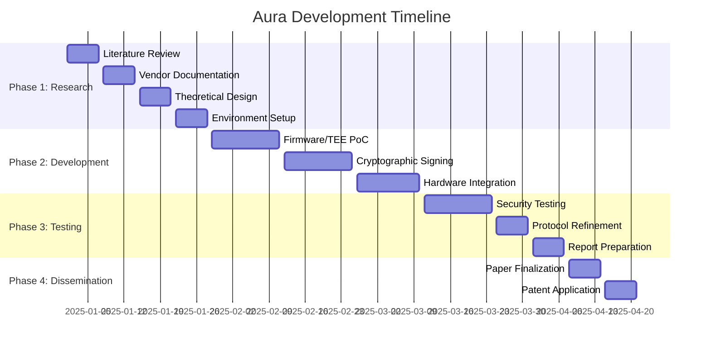

# 📅 Plan and Timeline (Accelerated)

**A comprehensive 16-week roadmap for developing hardware-level cryptographic attestation for image sensors**

---

## 🎯 Project Overview

This timeline represents an **ambitious but achievable** 16-week research and development plan designed to deliver a comprehensive proof-of-concept for hardware-level image attestation. The plan assumes dedicated research effort and leverages existing technologies where possible.

### 📊 Timeline Summary

## 📚 Phase 1: Foundational Research & Feasibility (Weeks 1-4)

### 🎯 Phase Objectives
- Establish comprehensive understanding of existing research and technologies
- Assess feasibility of different implementation approaches
- Design theoretical framework for cryptographic attestation
- Prepare development environment and acquire necessary resources

### 📅 Detailed Week-by-Week Breakdown

#### Week 1: 📖 Literature Review & Research Analysis
**Focus**: In-depth literature review of existing research

**Activities**:
- **Academic Research**: Review papers on camera security, trusted computing, and image provenance
- **Industry Analysis**: Study existing solutions (CAI, Project Origin, Truepic)
- **Technology Survey**: Analyze ARM TrustZone, Intel SGX, and TPM implementations
- **Gap Analysis**: Identify research gaps and opportunities

**Deliverables**:
- Comprehensive literature review document
- Technology comparison matrix
- Research gap analysis report

#### Week 2: 🔍 Vendor Documentation & Feasibility Assessment
**Focus**: Investigate camera vendor documentation and developer kits

**Activities**:
- **Vendor Research**: Analyze documentation from Sony, Canon, Nikon, and other manufacturers
- **Developer Kit Analysis**: Evaluate Magic Lantern, CHDK, and OpenIPC capabilities
- **Hardware Assessment**: Study sensor specifications and firmware access methods
- **Feasibility Scoring**: Rate different implementation approaches

**Deliverables**:
- Vendor capability assessment
- Hardware feasibility report
- Implementation path recommendations

#### Week 3: 🏗️ Theoretical Design & Architecture
**Focus**: Initial theoretical design of cryptographic pipeline and chain of trust

**Activities**:
- **System Architecture**: Design overall system architecture
- **Cryptographic Framework**: Define cryptographic protocols and algorithms
- **Security Model**: Develop threat model and security requirements
- **Performance Analysis**: Estimate computational and power requirements

**Deliverables**:
- System architecture document
- Cryptographic protocol specification
- Security model and threat analysis
- Performance requirements document

#### Week 4: ⚙️ Development Environment Setup
**Focus**: Set up development environment and acquire necessary hardware

**Activities**:
- **Hardware Procurement**: Acquire Raspberry Pi, camera modules, and development boards
- **Software Setup**: Install development tools, compilers, and libraries
- **Testing Environment**: Configure testing and validation frameworks
- **Documentation Setup**: Establish documentation and version control systems

**Deliverables**:
- Configured development environment
- Hardware inventory and specifications
- Development workflow documentation

---

## 💻 Phase 2: Prototyping & Development (Weeks 5-10)

### 🎯 Phase Objectives
- Develop working proof-of-concept implementations
- Implement core cryptographic functionality
- Integrate components into cohesive system
- Validate technical feasibility

### 📅 Detailed Week-by-Week Breakdown

#### Weeks 5-6: 🛠️ Proof-of-Concept Development
**Focus**: Develop proof-of-concept for firmware encryption or TEE-based processing

**Activities**:
- **Path Selection**: Choose primary implementation path based on Phase 1 findings
- **Firmware Development**: Implement secure firmware modifications (if Path 1)
- **TEE Implementation**: Develop Trusted Application for secure processing (if Path 4)
- **Basic Integration**: Create basic integration between components

**Deliverables**:
- Working proof-of-concept prototype
- Technical implementation report
- Performance baseline measurements

#### Weeks 7-8: 🔐 Cryptographic Signing Implementation
**Focus**: Implement basic cryptographic signing mechanism for raw image data

**Activities**:
- **Key Management**: Implement secure key generation and storage
- **Signing Algorithm**: Implement ECC-based signing for image data
- **Hash Functions**: Integrate secure hash functions for data integrity
- **Signature Verification**: Develop verification algorithms

**Deliverables**:
- Cryptographic signing implementation
- Key management system
- Signature verification tools

#### Weeks 9-10: 🔗 System Integration
**Focus**: Integrate signing mechanism with chosen hardware or simulated environment

**Activities**:
- **End-to-End Integration**: Connect all system components
- **Real-Time Processing**: Implement real-time image capture and signing
- **Error Handling**: Develop robust error handling and recovery mechanisms
- **Performance Optimization**: Optimize for minimal latency and power consumption

**Deliverables**:
- Fully integrated system prototype
- Performance optimization report
- Integration testing results

---

## 🔬 Phase 3: Testing & Refinement (Weeks 11-14)

### 🎯 Phase Objectives
- Conduct comprehensive security testing
- Optimize system performance
- Refine cryptographic protocols
- Prepare detailed analysis and documentation

### 📅 Detailed Week-by-Week Breakdown

#### Weeks 11-12: 🧪 Security Testing & Vulnerability Assessment
**Focus**: Rigorous testing for security vulnerabilities and performance overhead

**Activities**:
- **Penetration Testing**: Conduct comprehensive security testing
- **Performance Analysis**: Measure impact on camera performance and battery life
- **Stress Testing**: Test system under various load conditions
- **Vulnerability Assessment**: Identify and document potential security issues

**Deliverables**:
- Security testing report
- Performance analysis document
- Vulnerability assessment report
- Mitigation recommendations

#### Week 13: ⚡ Protocol Refinement & Optimization
**Focus**: Refine cryptographic protocols and optimize implementation

**Activities**:
- **Protocol Updates**: Refine cryptographic protocols based on testing results
- **Performance Optimization**: Implement performance improvements
- **Security Hardening**: Address identified vulnerabilities
- **Code Review**: Conduct thorough code review and documentation

**Deliverables**:
- Refined cryptographic protocols
- Optimized implementation
- Updated security documentation
- Code review report

#### Week 14: 📊 Report Preparation & Documentation
**Focus**: Prepare detailed findings report and research paper/patent draft

**Activities**:
- **Results Analysis**: Analyze all testing and development results
- **Documentation**: Prepare comprehensive technical documentation
- **Research Paper**: Draft research paper for conference submission
- **Patent Draft**: Prepare initial patent application draft

**Deliverables**:
- Comprehensive project report
- Research paper draft
- Patent application draft
- Technical documentation

---

## 📄 Phase 4: Dissemination (Weeks 15-16)

### 🎯 Phase Objectives
- Finalize research paper for publication
- Complete patent application
- Present project findings to stakeholders
- Plan next steps and future development

### 📅 Detailed Week-by-Week Breakdown

#### Week 15: 📄 Research Paper Finalization
**Focus**: Finalize research paper for submission to relevant conference or journal

**Activities**:
- **Paper Review**: Conduct final review and editing of research paper
- **Conference Selection**: Identify appropriate conferences for submission
- **Submission Preparation**: Prepare paper for submission with all required materials
- **Presentation Preparation**: Develop presentation materials for conferences

**Deliverables**:
- Finalized research paper
- Conference submission materials
- Presentation slides
- Submission confirmation

#### Week 16: 🎯 Patent Application & Project Presentation
**Focus**: Finalize patent application and present project findings

**Activities**:
- **Patent Finalization**: Complete patent application with all technical details
- **Legal Review**: Conduct legal review of patent application
- **Stakeholder Presentation**: Present findings to key stakeholders
- **Future Planning**: Develop roadmap for next phase of development

**Deliverables**:
- Completed patent application
- Stakeholder presentation
- Future development roadmap
- Project completion report

---

## 🎯 Success Metrics & Milestones

### 📊 Key Performance Indicators

| Metric | Target | Measurement Method |
|--------|--------|-------------------|
| **Security Strength** | 256-bit ECC equivalent | Cryptographic analysis |
| **Performance Impact** | < 5% processing overhead | Benchmark testing |
| **Power Consumption** | < 10% battery impact | Power measurement |
| **Verification Speed** | < 100ms per image | Timing analysis |
| **Compatibility** | Cross-platform verification | Multi-platform testing |

### 🏆 Milestone Deliverables

- **Week 4**: Complete feasibility study and technical design
- **Week 8**: Working cryptographic signing implementation
- **Week 10**: Fully integrated proof-of-concept system
- **Week 12**: Comprehensive security and performance analysis
- **Week 14**: Research paper and patent application drafts
- **Week 16**: Final deliverables and stakeholder presentation
