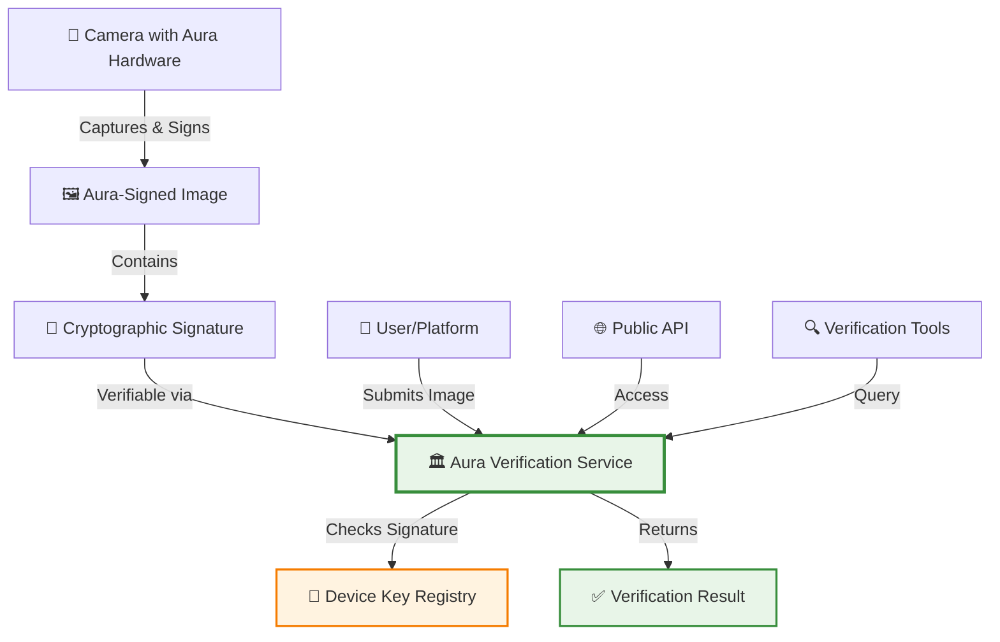
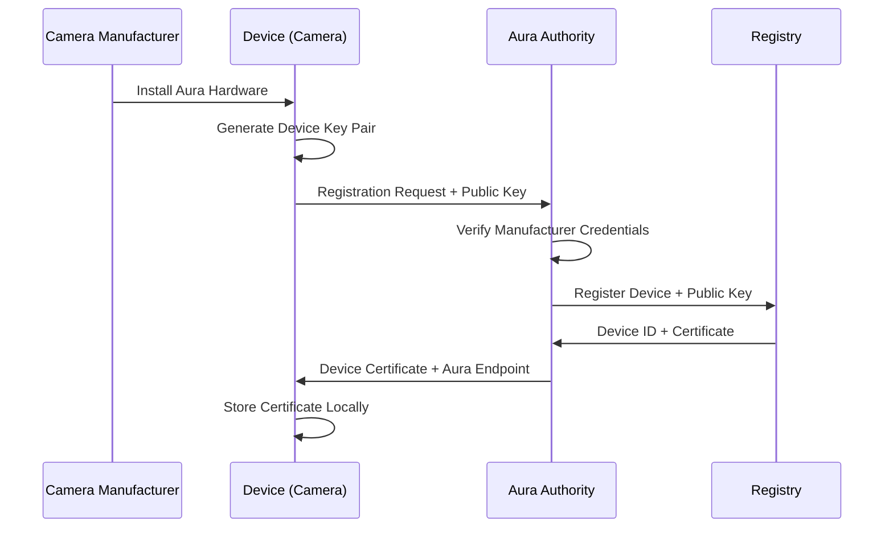

# 🏛️ Aura as the Source of Trust: Central Verification Authority

<div align="center">

**Establishing Aura as the authoritative source for image authenticity verification**

[](https://github.com/yourusername/aura)
[](https://github.com/yourusername/aura)
[](https://github.com/yourusername/aura)

</div>

---

## 🎯 Executive Summary

Aura positions itself as **the definitive source of trust** for visual media authenticity. Through our hardware-level cryptographic attestation system, we establish an unforgeable chain of verification that makes Aura the authoritative verification service that individuals, platforms, and institutions can rely upon to confirm image authenticity.

### Core Concept

Unlike distributed verification systems where trust is fragmented, Aura establishes itself as the **central verification authority** through:

1. **Hardware-Level Attestation**: Cryptographic signatures created at sensor level cannot be forged
2. **Central Verification Infrastructure**: Aura maintains the authoritative database of device keys and signatures
3. **Universal Verification Service**: Any party can verify images through Aura's verification API
4. **Trusted Third Party**: Aura serves as the neutral, trusted authority for authenticity claims

---

## 🏗️ Architecture: Centralized Trust Model

### The Aura Verification Ecosystem



### Key Components

#### 1. Hardware-Level Signing Authority
- **Device Registration**: Each Aura-enabled camera registers with Aura's central authority
- **Key Management**: Aura maintains the authoritative registry of device public keys
- **Signature Generation**: Signatures are cryptographically bound to the hardware root of trust
- **Attestation Chain**: Complete chain from sensor to final image verified by Aura

#### 2. Central Verification Service
- **Signature Database**: Central repository of all device keys and verification metadata
- **Verification API**: RESTful API for real-time image verification
- **Audit Logging**: Complete audit trail of all verification requests
- **Rate Limiting**: Secure and scalable verification infrastructure

#### 3. Trust Infrastructure
- **Public Key Infrastructure**: Aura operates the PKI for device keys
- **Certificate Authority**: Aura serves as the CA for device certificates
- **Revocation Lists**: Maintains lists of compromised or revoked devices
- **Key Rotation**: Manages secure key rotation and updates

---

## 🔐 Technical Implementation

### Device Registration and Enrollment



### Signature Structure

Each Aura-signed image contains:

1. **Device Signature**: ECDSA signature over image hash using device private key
2. **Timestamp**: Cryptographically signed timestamp of capture
3. **Device Certificate**: Aura-issued certificate proving device authenticity
4. **Processing Chain**: Signed log of all processing steps
5. **Metadata**: Signed metadata (location, camera settings, etc.)

### Verification Process

```python
# Pseudocode for Aura Verification
def verify_aura_image(image, signature_data):
    # 1. Extract device certificate
    device_cert = signature_data.certificate
    
    # 2. Verify certificate with Aura CA
    if not verify_certificate_with_aura(device_cert):
        return VerificationResult(authentic=False, reason="Invalid certificate")
    
    # 3. Extract device public key
    device_public_key = device_cert.public_key
    
    # 4. Verify signature over image
    image_hash = hash_image(image)
    if not verify_signature(image_hash, signature_data.signature, device_public_key):
        return VerificationResult(authentic=False, reason="Signature invalid")
    
    # 5. Check revocation list
    if device_cert.serial_number in get_revocation_list():
        return VerificationResult(authentic=False, reason="Device revoked")
    
    # 6. Verify timestamp is reasonable
    if not verify_timestamp(signature_data.timestamp):
        return VerificationResult(authentic=False, reason="Timestamp invalid")
    
    # 7. Check processing chain integrity
    if not verify_processing_chain(signature_data.processing_chain):
        return VerificationResult(authentic=False, reason="Processing chain broken")
    
    return VerificationResult(authentic=True, device_id=device_cert.device_id)
```

---

## 🌐 Aura Verification Service API

### Core Endpoints

#### 1. Verify Image
```
POST /api/v1/verify
Content-Type: multipart/form-data

{
    "image": <image_file>,
    "signature_data": <json_signature_metadata>
}

Response:
{
    "authentic": true,
    "device_id": "AURA-DEV-12345",
    "timestamp": "2025-01-15T10:30:00Z",
    "verification_level": "hardware_attested",
    "change_detection": {
        "has_ai_changes": false,
        "has_cosmetic_changes": false,
        "change_details": []
    }
}
```

#### 2. Get Device Information
```
GET /api/v1/device/{device_id}

Response:
{
    "device_id": "AURA-DEV-12345",
    "manufacturer": "CameraCorp",
    "model": "ProShot X1",
    "registered": "2025-01-01T00:00:00Z",
    "status": "active",
    "public_key": "..."
}
```

#### 3. Query Verification History
```
GET /api/v1/verifications?device_id={device_id}&limit=100

Response:
{
    "verifications": [
        {
            "verification_id": "VER-001",
            "timestamp": "2025-01-15T10:30:00Z",
            "authentic": true,
            "image_hash": "..."
        }
    ]
}
```

---

## 🔍 Trust Properties and Guarantees

### What Aura Guarantees

| Guarantee | Description | Technical Basis |
|-----------|-------------|----------------|
| **Physical Capture** | Image was captured by real camera sensor | Hardware root of trust signature |
| **Tamper Detection** | Any modification to image is detectable | Cryptographic hash verification |
| **Device Authenticity** | Device is legitimate Aura-registered hardware | Certificate chain verification |
| **Timestamp Integrity** | Capture timestamp is cryptographically signed | Signed timestamp in signature |
| **Processing Provenance** | Complete record of all processing steps | Signed processing chain |

### What Aura Does NOT Guarantee

- **Content Accuracy**: Aura verifies the image was captured, not that it represents reality accurately
- **Editorial Truth**: Aura doesn't verify the truthfulness of image content
- **Legal Admissibility**: Verification is evidence, but legal systems make final determination
- **Privacy**: Aura doesn't control how images are used after verification

---

## 🛡️ Security Model

### Threat Mitigation

#### 1. Device Key Compromise
- **Revocation Lists**: Compromised devices immediately revoked
- **Key Rotation**: Secure key rotation mechanisms
- **Physical Security**: Keys stored in hardware security modules
- **Monitoring**: Continuous monitoring for suspicious activity

#### 2. Certificate Authority Compromise
- **Hierarchical Trust**: Multi-level certificate hierarchy
- **Key Escrow**: Secure backup of critical keys
- **Audit Logging**: Complete audit trail of all operations
- **Incident Response**: Rapid response procedures

#### 3. Man-in-the-Middle Attacks
- **TLS/HTTPS**: All API communication encrypted
- **Message Authentication**: All messages cryptographically authenticated
- **Replay Protection**: Timestamps and nonces prevent replay attacks

#### 4. Service Availability
- **Distributed Infrastructure**: Geographically distributed servers
- **Redundancy**: Multiple verification paths
- **Rate Limiting**: Prevents denial of service attacks
- **Caching**: Efficient caching for performance

---

## 📊 Verification Levels

### Hardware Attested (Level 5)
- **Definition**: Image signed by hardware root of trust at sensor level
- **Confidence**: 99.9%+
- **Use Cases**: Legal evidence, journalism, scientific documentation
- **Verification**: Complete chain verification through Aura

### Firmware Attested (Level 4)
- **Definition**: Image signed by verified firmware (fallback mode)
- **Confidence**: 95%+
- **Use Cases**: Professional photography, corporate communications
- **Verification**: Firmware certificate verification

### Software Attested (Level 3)
- **Definition**: Image signed by software-based signing (legacy mode)
- **Confidence**: 80%+
- **Use Cases**: Consumer photography, social media
- **Verification**: Software certificate verification

### Unverified (Level 0)
- **Definition**: No Aura signature present
- **Confidence**: 0%
- **Use Cases**: Legacy images, third-party sources
- **Verification**: Cannot verify authenticity

---

## 🌍 Ecosystem Integration

### Platform Integration

#### Social Media Platforms
- **API Integration**: Platforms query Aura to verify images
- **Visual Indicators**: Badge showing "Aura Verified" on images
- **Trust Scoring**: Platforms can rank content based on verification status
- **Moderation Tools**: Automated detection of unverified suspicious content

#### News Organizations
- **Journalism Tools**: Integration with newsroom workflow
- **Automatic Verification**: Automatic verification of submitted images
- **Editorial Standards**: Enforce verification requirements for publication
- **Transparency**: Public disclosure of verification status

#### Legal and Forensic
- **Evidence Management**: Integration with evidence management systems
- **Court Presentation**: Tools for presenting verification in court
- **Expert Testimony**: Verification reports for legal proceedings
- **Chain of Custody**: Complete audit trail for legal requirements

### Developer Integration

#### SDK and Libraries
- **Python SDK**: Python library for verification
- **JavaScript SDK**: Browser and Node.js verification libraries
- **Mobile SDKs**: iOS and Android SDKs for app integration
- **CLI Tools**: Command-line tools for batch verification

---

## 📈 Trust Metrics and Analytics

### Trust Score Calculation

```
Trust Score = Base Authenticity (Hardware Attested: 100, Firmware: 75, Software: 50)
            + Device Reputation Score (0-20)
            + Verification History (0-10)
            - Penalty for Changes (AI: -50, Cosmetic: -10)
```

### Analytics Dashboard

- **Verification Volume**: Total images verified over time
- **Authenticity Rate**: Percentage of verified authentic images
- **Change Detection**: Breakdown of AI vs cosmetic changes
- **Device Statistics**: Most common devices, manufacturers
- **Geographic Distribution**: Verification requests by location

---

## 🔮 Future Vision

### Long-Term Goals

1. **Industry Standard**: Aura becomes the de facto standard for image verification
2. **Global Adoption**: Integrated into all major camera manufacturers
3. **Regulatory Recognition**: Recognized by legal systems globally
4. **Platform Integration**: Built into all major content platforms
5. **Consumer Trust**: Consumers can instantly verify any image

### Strategic Partnerships

- **Camera Manufacturers**: Hardware integration partnerships
- **Content Platforms**: API partnerships for verification
- **Standards Bodies**: Participation in standards development
- **Government Agencies**: Collaboration on regulatory compliance

---

## 🎯 Success Metrics

### Technical Metrics
- **Verification Accuracy**: >99.9% accuracy in authenticity detection
- **API Latency**: <100ms average verification time
- **Uptime**: 99.9% service availability
- **Throughput**: Support for 1M+ verifications per day

### Business Metrics
- **Adoption Rate**: 10%+ of new cameras Aura-enabled within 3 years
- **Verification Volume**: 1M+ images verified daily within 2 years
- **Platform Partnerships**: 10+ major platform integrations
- **Developer Adoption**: 1000+ developers using Aura SDKs

### Trust Metrics
- **Public Trust**: Consumer surveys showing increased trust in verified content
- **Industry Recognition**: Awards and recognition from security industry
- **Legal Precedence**: Legal cases using Aura verification
- **Media Coverage**: Positive coverage in major news outlets

---

<div align="center">

## Establishing Aura as the Authoritative Source of Trust

**Through hardware-level cryptographic attestation, centralized verification infrastructure, and comprehensive trust guarantees, Aura becomes the definitive authority for visual media authenticity.**

*Last updated: January 2025*

</div>
