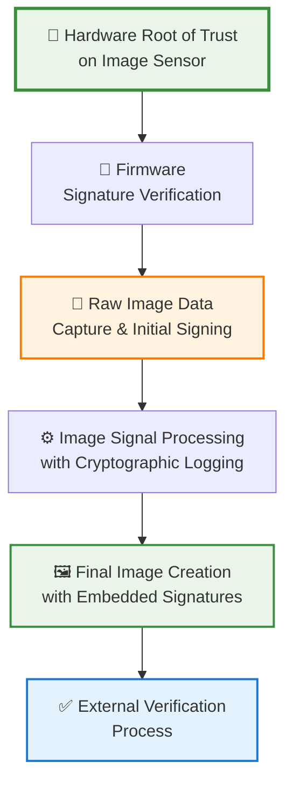
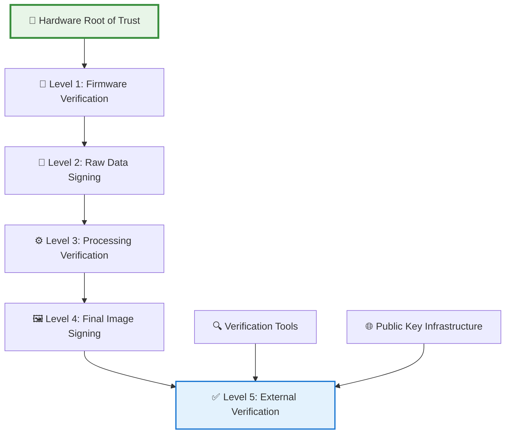

# 🔗 Chain of Trust

**Establishing verifiable cryptographic links from hardware root of trust to final application output**

---

## 🎯 Overview

A **chain of trust** is a fundamental security concept where each component in a system is verified by a previously trusted component, starting from a **hardware root of trust**. This creates an unbreakable link of cryptographic verification that ensures the integrity and authenticity of data throughout its entire lifecycle.

### 🔑 Core Principles

| Principle | Description | Application in Aura |
|-----------|-------------|-------------------|
| **🔧 Hardware Root of Trust** | Immutable component that cannot be tampered with | Image sensor with embedded cryptographic module |
| **🔗 Sequential Verification** | Each step verifies the next before execution | Every processing stage cryptographically verified |
| **🔐 Cryptographic Integrity** | Digital signatures ensure data hasn't been modified | Image data signed at each processing step |
| **🌐 Universal Verification** | Anyone can verify the entire chain using public keys | External parties can verify image authenticity |

## 🏗️ How Chain of Trust Works

### Traditional Computing Chain

### Aura-Specific Chain of Trust

For image provenance, our chain of trust follows this sequence:

## 🔧 Hardware Root of Trust

### Definition and Requirements

The **hardware root of trust** is the foundation of the entire chain. It must be:

- **🔒 Immutable**: Cannot be modified by software or firmware
- **🛡️ Tamper-Resistant**: Physical modification required to compromise
- **🔐 Cryptographically Capable**: Can perform signing and verification operations
- **📱 Uniquely Identifiable**: Each device has unique cryptographic identity

### Implementation Options

| Implementation | Description | Pros | Cons |
|----------------|-------------|------|------|
| **🔧 Dedicated Security Chip** | Separate cryptographic processor | Strong isolation, proven security | Additional cost, complexity |
| **🔒 Integrated Secure Element** | Security module integrated with sensor | Cost-effective, compact | Potential integration challenges |
| **🛡️ TPM Integration** | Use existing TPM standards | Industry standard, proven | May not be available in all cameras |
| **📱 ARM TrustZone** | Hardware security extension | Wide availability, good performance | Requires ARM processor |

## 🔗 Chain Components for Image Provenance

### 1. 🔧 Hardware Root of Trust on Sensor

**Purpose**: Immutable component that stores private keys and performs cryptographic operations

**Implementation**:
- Secure element integrated with image sensor
- Stores unique private key for device
- Performs cryptographic signing operations
- Provides secure boot capabilities

**Security Properties**:
- Physical tampering required to compromise
- Cannot be accessed by software
- Provides cryptographic attestation

### 2. 🔐 Signed Firmware Verification

**Purpose**: Ensure only authentic firmware runs on the device

**Process**:
- Firmware signed with manufacturer's private key
- Hardware root of trust verifies signature before execution
- Only verified firmware can access cryptographic functions
- Prevents unauthorized firmware modifications

**Security Benefits**:
- Prevents firmware-based attacks
- Ensures cryptographic operations are legitimate
- Maintains chain integrity from boot

### 3. 📸 Raw Image Data Signing

**Purpose**: Create cryptographic "birth certificate" for each image

**Process**:
- Raw image data captured by sensor
- Immediately signed by hardware root of trust
- Signature includes timestamp, sensor ID, and image hash
- Creates unforgeable proof of physical capture

**Verification**:
- External parties can verify using device's public key
- Confirms image came from specific sensor
- Proves image hasn't been modified since capture

### 4. ⚙️ Image Signal Processing Logging

**Purpose**: Maintain cryptographic record of all processing steps

**Process**:
- Each processing step (demosaicing, noise reduction, etc.) logged
- Processing parameters cryptographically signed
- Chain of processing steps maintained
- Final image includes complete processing history

**Benefits**:
- Complete provenance tracking
- Verification of legitimate processing
- Detection of unauthorized modifications

### 5. ✅ External Verification Process

**Purpose**: Allow anyone to verify image authenticity

**Process**:
- Use device's public key to verify signatures
- Check entire chain from raw data to final image
- Verify processing steps are legitimate
- Confirm image integrity and authenticity

**Capabilities**:
- Universal verification (no proprietary tools needed)
- Real-time verification
- Batch verification for multiple images

## 🎯 Implementation Strategy

### Cryptographic Framework

Our chain of trust implementation uses:

- **🔐 Elliptic Curve Cryptography (ECC)**: Efficient for embedded systems
- **🛡️ SHA-256 Hashing**: Secure hash function for data integrity
- **📱 Digital Signatures**: ECDSA for signing operations
- **🔒 Key Management**: Secure key generation and storage

### Performance Optimization

| Optimization | Description | Impact |
|--------------|-------------|---------|
| **⚡ Parallel Processing** | Signing operations parallel to image processing | Minimal latency impact |
| **🔋 Power Management** | Cryptographic operations optimized for power | Minimal battery impact |
| **📱 Memory Efficiency** | Optimized data structures and algorithms | Reduced memory usage |
| **🌐 Network Optimization** | Efficient signature verification protocols | Fast verification |

## 🔬 Advanced Chain of Trust Features

### Multi-Level Verification

### Chain Integrity Monitoring

- **🔍 Continuous Verification**: Real-time monitoring of chain integrity
- **📊 Anomaly Detection**: Automatic detection of chain breaks
- **🛡️ Self-Healing**: Automatic recovery from minor chain issues
- **📱 Reporting**: Detailed reporting of chain status and issues

## 🛡️ Security Benefits

### Protection Against Attacks

| Attack Type | How Chain of Trust Protects | Mitigation |
|-------------|----------------------------|------------|
| **🦠 Firmware Attacks** | Hardware root of trust verifies firmware | Only authentic firmware can run |
| **🔓 Image Tampering** | Cryptographic signatures detect modifications | Any change breaks signature verification |
| **📱 Man-in-the-Middle** | End-to-end cryptographic protection | Cannot intercept or modify signed data |
| **🔐 Key Compromise** | Hardware-protected key storage | Physical access required to extract keys |

### Trust Properties

- **🔒 Unforgeability**: Cannot create fake signatures without private key
- **🛡️ Tamper Detection**: Any modification breaks chain verification
- **🌐 Universal Verification**: Anyone can verify using public keys
- **📱 Scalability**: Works across different devices and platforms
