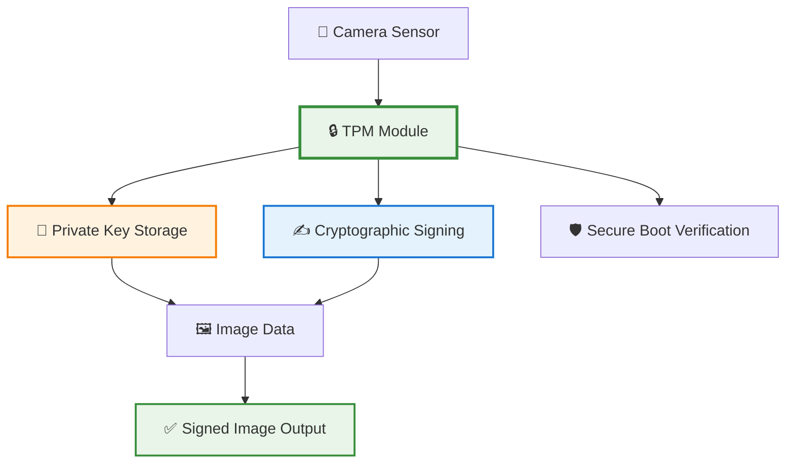

# 🏗️ Trusted Computing

**Foundational principles and technologies for establishing hardware-level trust in computing systems**

---

## 🎯 Overview

Trusted Computing is a comprehensive technology framework developed and promoted by the **Trusted Computing Group (TCG)**. The core principle is to establish a **"root of trust"**—a set of hardware and software components that are inherently trusted and cannot be compromised.

### 🔑 Key Concepts

| Concept | Description | Application in Aura |
|---------|-------------|-------------------|
| **🔒 Root of Trust** | Immutable hardware component that performs cryptographic operations | Image sensor with embedded cryptographic module |
| **🛡️ Trusted Platform Module (TPM)** | Dedicated microchip for hardware security | Secure key storage and cryptographic operations |
| **🔗 Chain of Trust** | Sequence of security checks from hardware to applications | Verification from sensor to final image |
| **📋 Remote Attestation** | Proving platform integrity to remote parties | Verifying image authenticity to external systems |

## 🔐 Trusted Platform Module (TPM)

### What is a TPM?

A **Trusted Platform Module (TPM)** is a dedicated microchip designed to secure hardware by integrating cryptographic keys into devices. It provides a hardware-based foundation for security operations.

### TPM Capabilities

#### 🔒 Secure Boot
- **Purpose**: Ensures that the system boots with trusted software
- **Process**: Hardware verifies digital signatures before executing code
- **Application**: Prevents unauthorized firmware modifications in cameras

#### 🌐 Remote Attestation
- **Purpose**: Proves the integrity of a platform to a remote party
- **Process**: Generates cryptographic proof of system state
- **Application**: Allows external verification of camera authenticity

#### 🔐 Sealed Storage
- **Purpose**: Encrypts data so it can only be decrypted by the same TPM
- **Process**: Data encrypted with TPM-specific keys
- **Application**: Protects cryptographic keys used for image signing

### TPM in Camera Systems

## 🔗 Chain of Trust

### Definition

A **chain of trust** is a security concept where each component in a system is verified by a previously trusted component, starting from a hardware root of trust.

### How It Works

1. **🔧 Hardware Root of Trust**: The process begins with a component that is inherently trusted (e.g., TPM, secure boot ROM)
2. **🚀 Bootloader Verification**: The hardware root of trust verifies the digital signature of the bootloader before executing it
3. **💻 Operating System Verification**: The bootloader then verifies the signature of the operating system kernel
4. **📱 Application Verification**: The operating system can then verify the signatures of applications before they are run

### Chain of Trust for Image Provenance

For the Aura project, the chain of trust would follow this sequence:

### Detailed Chain Components

1. **🔧 Hardware Root of Trust on the Sensor**
   - **Purpose**: Immutable component that stores private keys and performs cryptographic operations
   - **Implementation**: Secure element integrated with image sensor
   - **Security**: Physical tampering required to compromise

2. **🔐 Signed Firmware**
   - **Purpose**: Camera firmware is signed with a key verified by the hardware root of trust
   - **Process**: Secure boot ensures only authentic firmware runs
   - **Protection**: Prevents unauthorized firmware modifications

3. **📸 Signed Image Data**
   - **Purpose**: Raw image data is immediately signed by the hardware root of trust
   - **Process**: Creates verifiable "birth certificate" for each image
   - **Verification**: External parties can verify authenticity using public keys

4. **✅ Verification Process**
   - **Purpose**: External verification of the entire chain
   - **Process**: Uses camera's public key to verify signatures
   - **Result**: Confirms image authenticity and integrity

## 🎯 Relevance to Aura Project

### Critical Importance

Trusted Computing principles are **fundamental** to the Aura project because they provide:

- **🔒 Hardware-Level Security**: Cryptographic operations performed at the sensor level
- **🛡️ Tamper Resistance**: Physical modification required to compromise security
- **🌐 Universal Verification**: Anyone can verify authenticity with public keys
- **📱 Scalable Implementation**: Proven technology that can be adapted to camera systems

### Implementation Strategy

Our approach leverages trusted computing concepts by:

1. **🔧 Establishing Hardware Root of Trust**: Integrate TPM-like functionality into camera sensors
2. **🔗 Building Chain of Trust**: Create verifiable link from sensor to final image
3. **🛡️ Ensuring Tamper Resistance**: Use hardware-based security mechanisms
4. **🌐 Enabling Universal Verification**: Provide public key infrastructure for verification

### Technical Benefits

| Benefit | Description | Impact |
|---------|-------------|---------|
| **🔒 Unbreakable Security** | Hardware-based cryptographic operations | Cannot be bypassed by software attacks |
| **⚡ Real-Time Attestation** | Images signed during capture | Prevents post-capture tampering |
| **🛡️ Physical Security** | Tamper-resistant hardware design | Extremely difficult to compromise |
| **🌐 Industry Standard** | Based on established TCG standards | Wide industry acceptance and support |

## 🔬 Current TCG Standards (2025)

### Latest Developments

- **TPM 2.0**: Latest specification with enhanced security features and improved performance
- **Device Identifier Composition Engine (DICE)**: Lightweight attestation for IoT devices
- **Trusted Network Connect (TNC)**: Network access control based on device trust
- **Mobile Trusted Module (MTM)**: TPM implementation for mobile devices
- **Hardware Security Module (HSM) Integration**: Enhanced HSM support for embedded systems

### Relevance to Camera Security

These standards provide:

- **📱 Mobile Integration**: MTM standards applicable to smartphone cameras
- **🌐 IoT Security**: DICE standards relevant for IP cameras
- **🔒 Enhanced Cryptography**: TPM 2.0 supports modern cryptographic algorithms
- **🛡️ Network Security**: TNC standards for secure camera communication
