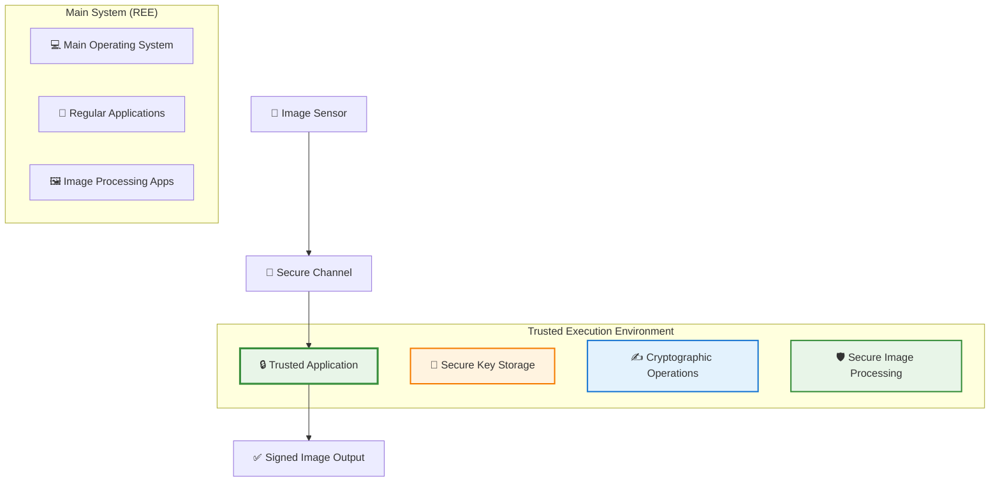
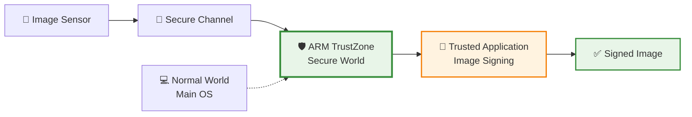
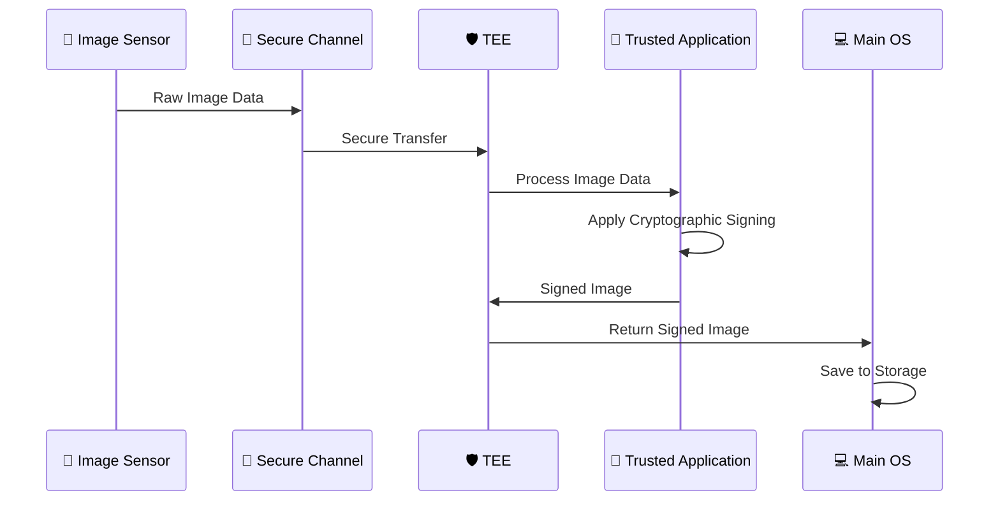

# 🔒 Trusted Execution Environments (TEE)

**Secure, isolated execution environments for protecting sensitive operations from compromised operating systems**

---

## 🎯 Overview

A **Trusted Execution Environment (TEE)** is a secure area inside a main processor that is isolated from the main operating system. It ensures that code and data loaded inside the TEE are protected with respect to **confidentiality** and **integrity**, even if the main operating system is compromised.

### 🔑 Key Features

| Feature | Description | Benefit |
|---------|-------------|---------|
| **🛡️ Isolation** | TEE is isolated from the "Rich Execution Environment" (REE) | Prevents main OS attacks from affecting secure operations |
| **🔐 Secure Storage** | TEEs provide secure storage for sensitive data | Protects cryptographic keys and other secrets |
| **📱 Trusted Applications** | Code running inside the TEE has access to security features | Enables secure image processing and signing |
| **🔒 Hardware Backing** | Security is enforced by hardware, not software | Cannot be bypassed by software attacks |

## 🏗️ TEE Architecture

### High-Level Architecture

### Security Model

The TEE provides **strong isolation** through:

- **🔒 Memory Isolation**: TEE memory is protected from REE access
- **🛡️ CPU Privilege**: TEE runs at higher privilege level
- **🔐 Secure Boot**: Only verified code can run in TEE
- **📱 Attestation**: TEE can prove its integrity to external parties

## 🏭 Popular TEE Implementations

### 🟢 ARM TrustZone

**ARM TrustZone** is a hardware-based security extension for ARM processors that partitions the processor into two worlds:

#### Architecture
- **🔒 Secure World**: Runs the TEE and trusted applications
- **🌐 Normal World**: Runs the main operating system and regular applications
- **🛡️ Hardware Enforcement**: Security is enforced by the processor hardware

#### Key Features
- **🔐 Secure Monitor**: Manages transitions between worlds
- **🛡️ Trusted Boot**: Ensures only verified code runs in secure world
- **📱 Rich OS Integration**: Seamless integration with Android and Linux
- **🔒 Hardware Root of Trust**: Built-in secure boot capabilities

#### Implementation in Cameras

### 🔵 Intel SGX (Software Guard Extensions)

**Intel SGX** is a set of instructions that allows user-level code to create private regions of memory, called **enclaves**, that are protected from processes running at higher privilege levels.

#### Architecture
- **🔒 Enclaves**: Isolated memory regions for secure code execution
- **🛡️ Hardware Protection**: CPU enforces memory access restrictions
- **🔐 Attestation**: Enclaves can prove their integrity
- **📱 Flexible Implementation**: Can be used in various applications

#### Key Features
- **🔐 Enclave Creation**: Secure memory regions for sensitive operations
- **🛡️ Memory Encryption**: Enclave memory is encrypted when not in use
- **📱 Remote Attestation**: Prove enclave integrity to remote parties
- **🔒 Sealing**: Encrypt data that can only be decrypted by the same enclave

## 🎯 Relevance to Aura Project

### Why TEEs Are Perfect for Image Attestation

TEEs are **exceptionally well-suited** for the Aura project because they provide:

#### 🔒 Strong Isolation
- **Purpose**: Isolate image processing and signing from potentially compromised main OS
- **Benefit**: Even if the camera's main operating system is compromised, image signing remains secure
- **Implementation**: Raw image data processed entirely within TEE

#### 🔐 Secure Key Storage
- **Purpose**: Store cryptographic keys used for image signing
- **Benefit**: Keys are protected by hardware and cannot be extracted by software
- **Implementation**: Private keys stored in TEE's secure storage

#### ⚡ Real-Time Processing
- **Purpose**: Process and sign images in real-time during capture
- **Benefit**: Minimal performance impact while maintaining security
- **Implementation**: TEE handles image processing pipeline

### Implementation Strategy

Our TEE-based approach follows this workflow:

### Detailed Implementation Steps

1. **🔐 Secure Data Ingress**
   - Raw image data sent directly to Trusted Application
   - Secure channel prevents man-in-the-middle attacks
   - Data integrity verified before processing

2. **🛡️ Secure Processing**
   - Trusted Application processes raw image data
   - All operations performed within TEE isolation
   - Cryptographic signing using secure keys

3. **🔒 Secure Data Egress**
   - Final signed image passed out of TEE
   - Signature can be verified by anyone with public key
   - Only TEE could have created the signature

## 🔬 Current TEE Technologies (2025)

### Latest Developments

#### ARM TrustZone Enhancements
- **🔐 TrustZone-M**: Enhanced security for microcontrollers with improved performance
- **🛡️ Armv9-A**: Latest architecture with improved security features and AI acceleration
- **📱 Android TEE**: Enhanced integration with Android security and Google Play Protect
- **🔒 TrustZone for Cortex-M**: Optimized for embedded and IoT applications

#### Intel SGX Updates
- **🔒 SGX 2.0**: Enhanced enclave capabilities with improved performance
- **🛡️ TDX (Trust Domain Extensions)**: New virtualization security features
- **📱 Software Guard Extensions**: Continued development and optimization
- **🔐 Intel CET (Control-flow Enforcement Technology)**: Enhanced protection against control-flow attacks

#### Alternative Implementations
- **🔵 AMD Memory Guard**: AMD's equivalent to Intel SGX with enhanced security
- **🟢 RISC-V Keystone**: Open-source TEE implementation with growing adoption
- **🟡 Microsoft Pluton**: Security processor for Windows devices with enhanced capabilities
- **🟠 Apple Secure Enclave**: Enhanced security features for Apple devices

### Performance Considerations

| Aspect | ARM TrustZone | Intel SGX | Impact on Cameras |
|--------|---------------|-----------|-------------------|
| **⚡ Performance** | Minimal overhead | Moderate overhead | Both suitable for real-time processing |
| **🔋 Power Consumption** | Low impact | Moderate impact | TrustZone preferred for battery life |
| **📱 Integration** | Excellent | Good | TrustZone better for mobile cameras |
| **🔒 Security** | Hardware-enforced | Hardware-enforced | Both provide strong security |

## 🛡️ Security Benefits

### Protection Against Common Attacks

| Attack Type | How TEE Protects | Relevance to Cameras |
|-------------|------------------|---------------------|
| **🦠 Malware** | Isolated execution prevents malware from accessing TEE | Protects image signing from camera malware |
| **🔓 Rootkits** | Hardware isolation prevents rootkit access | Ensures image authenticity even with compromised OS |
| **📱 Side-Channel** | Hardware protection against timing/power analysis | Protects cryptographic keys from side-channel attacks |
| **🔐 Memory Attacks** | Encrypted memory and access control | Prevents memory-based key extraction |

### Trusted Application Security

- **🔒 Code Integrity**: Only verified code can run in TEE
- **🛡️ Data Protection**: Sensitive data encrypted and protected
- **📱 Attestation**: TEE can prove its integrity to external parties
- **🔐 Key Management**: Secure key generation, storage, and usage
