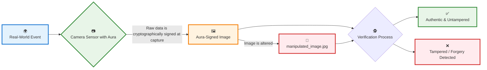

# Aura: Authenticating Reality at the Source

<div align="center">

**A research project on creating unforgeable proof of physical capture through hardware-level cryptographic attestation for image sensors.**

[](https://github.com/yourusername/aura)
[](https://opensource.org/licenses/MIT)
[](https://github.com/yourusername/aura/blob/main/CONTRIBUTING.md)
[](https://github.com/yourusername/aura)

</div>

---

## Table of Contents

- [The Problem](#the-problem-the-end-of-trust-in-visual-media)
- [The Solution](#the-solution-a-verifiable-chain-of-trust-from-photon-to-pixel)
- [How It Works](#how-it-works-proposed-research-paths)
- [Project Goals](#project-goals)
- [Repository Structure](#repository-structure)
- [Contributing](#contributing--getting-involved)
- [Roadmap & Timeline](#roadmap--timeline)

---

## The Problem: The End of Trust in Visual Media

We are at a critical technological inflection point. The rapid advancement of generative AI models like OpenAI's Sora, Midjourney, and DALL-E 3 has created a world where photorealistic images and videos can be generated from simple text prompts. While these tools represent incredible creative potential, they pose an existential threat to the integrity of visual information.

### The Crisis of Authenticity

In 2025, we face an unprecedented challenge: we can no longer instinctively trust what we see. This erosion of visual trust has profound implications across multiple domains:

| Domain | Impact | Example |
|--------|--------|---------|
| **Legal Evidence** | Court admissibility questioned | Video evidence dismissed as potential deepfake |
| **Journalism** | Credibility crisis | Authentic footage indistinguishable from propaganda |
| **Scientific Documentation** | Research integrity compromised | Visual data manipulation in peer-reviewed studies |
| **Personal Memories** | Historical record uncertainty | Family photos potentially AI-generated |

### Current Solutions Are Insufficient

Existing software-based approaches have fundamental weaknesses:

- **Watermarks**: Easily removed or forged
- **Metadata**: Can be stripped or manipulated  
- **Digital signatures**: Applied after capture, vulnerable to tampering
- **Blockchain timestamps**: Don't prove physical capture

We need a solution that operates as close to the source of reality as possible.

## The Solution: A Verifiable Chain of Trust from Photon to Pixel

**Aura** proposes a revolutionary paradigm for digital imaging: embedding cryptographic signing capabilities directly into camera sensors. By creating a cryptographic "birth certificate" for an image the moment light hits the sensor, we can establish a verifiable and unforgeable chain of trust.

### Core Innovation

This hardware-level approach provides a secure foundation for authenticity that cannot be compromised by software-level manipulations. It aims to become as fundamental for visual media as HTTPS is for web security.

### Key Advantages

- **Hardware-Level Security**: Cryptographic operations performed at the sensor level
- **Real-Time Attestation**: Images signed during capture, not after
- **Tamper-Resistant**: Physical modification required to compromise security
- **Universal Verification**: Anyone can verify authenticity with public keys
- **Future-Proof**: Compatible with existing and future imaging technologies

### Core Concept Diagram



---

---

## How It Works: Proposed Research Paths

Our research explores four primary approaches for implementing this system, as outlined in our comprehensive feasibility study. The most promising path involves a combination of a hardware-anchored Chain of Trust and a Trusted Execution Environment (TEE).

### The Secure Imaging Pipeline (Conceptual Diagram)

This diagram illustrates our leading approach, combining Path 2 (Chain of Trust) and Path 4 (TEE).

```mermaid
graph TD
    subgraph Camera Hardware
        A(📸 Image Sensor) -- Raw Data --> B(🔒 Secure Channel);
        B --> C{🛡️ Trusted Execution Environment};
    end

    subgraph TEE [Trusted Execution Environment (Isolated)]
        C -- Processes Data --> D[⚙️ Image Signal Processing];
        E(🔑 Secure Key Storage<br>Private Key) --> F[✍️ Cryptographic Signing];
        D -- Processed Data --> F;
    end
    
    F -- Signed Data --> G[✅ Completed & Signed Image];
    G --> H(💾 Storage<br>Memory Card);

    style TEE fill:#f8f9fa,stroke:#495057,stroke-width:2px,stroke-dasharray: 5 5
    style A fill:#e3f2fd,stroke:#1976d2,stroke-width:2px
    style E fill:#fff3e0,stroke:#f57c00,stroke-width:2px
    style F fill:#e8f5e8,stroke:#388e3c,stroke-width:2px
    style G fill:#e8f5e8,stroke:#388e3c,stroke-width:2px
```

### The Four Feasibility Paths

| Path | Approach | Feasibility | Key Benefits |
|------|----------|-------------|--------------|
| **1️⃣ Encrypt Firmware** | Harden camera's base software against tampering | ⭐⭐⭐⭐⭐ High | Prevents unauthorized firmware modifications |
| **2️⃣ Chain of Trust** | Establish verifiable cryptographic link from sensor to final image | ⭐⭐⭐⭐⭐ Very High | Complete provenance tracking |
| **3️⃣ Encrypt Pipeline** | Protect image data confidentiality through processing pipeline | ⭐⭐⭐⭐ Moderate-High | Prevents in-memory snooping |
| **4️⃣ TEE-based Processing** | Use secure enclave for isolated image processing and signing | ⭐⭐⭐⭐⭐ Very High | Strong isolation from main OS |

#### Detailed Path Analysis

**🔐 Path 1: Encrypt Firmware**
- **Goal**: Make camera's operating software tamper-proof
- **Implementation**: Secure boot mechanisms, firmware signing
- **Challenge**: Vendor cooperation required for firmware access
- **Enabler**: Open-source projects like Magic Lantern and CHDK

**🔗 Path 2: Chain of Trust** 
- **Goal**: Create verifiable link from sensor raw data to final image
- **Implementation**: Hardware root of trust, cryptographic logging
- **Advantage**: Well-established security concept
- **Application**: Every processing step cryptographically verified

**🔒 Path 3: Encrypt Pipeline**
- **Goal**: Protect image data confidentiality during processing
- **Implementation**: Real-time encryption/decryption
- **Consideration**: Performance impact on battery and processing
- **Value**: Enhanced when combined with other methods

**🛡️ Path 4: TEE-based Processing**
- **Goal**: Isolate sensitive operations in secure environment
- **Implementation**: ARM TrustZone, Intel SGX
- **Advantage**: Strong isolation, mature technology
- **Application**: Secure image processing and signing

## Project Goals

Our research aims to address the critical need for verifiable image authenticity through a comprehensive approach:

### Primary Objectives

- **Investigate Feasibility**: Determine the viability of implementing cryptographic primitives in current camera hardware and software stacks
- **Develop a Proof-of-Concept**: Create a working prototype on accessible hardware (Raspberry Pi with camera module) or in a simulated environment
- **Establish a Standard**: Propose an open standard for hardware-level image attestation that camera manufacturers can adopt
- **Publish Findings**: Produce a research paper and/or patent detailing the framework, its security guarantees, and performance implications

### Success Metrics

| Metric | Target | Measurement |
|--------|--------|-------------|
| **Security Strength** | Military-grade cryptographic security | 256-bit ECC or equivalent |
| **Performance Impact** | < 5% overhead | Processing time comparison |
| **Compatibility** | Universal verification | Cross-platform verification tools |
| **Adoption Potential** | Industry standard proposal | Manufacturer feedback and pilot programs |

## Repository Structure

This repository is organized into two main sections for comprehensive research documentation:

### Documentation Directory
Contains high-level project documents and strategic planning:

- **[Idea.md](Documentation/Idea.md)**: Core project concept and problem statement
- **[Mission&Vision.md](Documentation/Mission&Vision.md)**: Project mission, vision, and long-term goals  
- **[Plan.md](Documentation/Plan.md)**: Detailed timeline and milestone planning
- **[PRD.md](Documentation/PRD.md)**: Product Requirements Document with specifications
- **[Feasibility-Study.md](Documentation/Feasibility-Study.md)**: Comprehensive feasibility analysis of four implementation paths
- **[Existing-Research.md](Documentation/Existing-Research.md)**: Literature review and related work analysis

### Theory Directory  
Contains detailed technical documentation on core concepts:

- **[Chain-Of-Trust.md](Theory/Chain-Of-Trust.md)**: Cryptographic chain of trust implementation
- **[PKC-In-Embedded-Systems.md](Theory/PKC-In-Embedded-Systems.md)**: Public key cryptography in resource-constrained environments
- **[Threat-Modeling.md](Theory/Threat-Modeling.md)**: Security threat analysis and mitigation strategies
- **[Trusted-Computing.md](Theory/Trusted-Computing.md)**: Trusted computing principles and TPM integration
- **[Trusted-Execution-Environments.md](Theory/Trusted-Execution-Environments.md)**: TEE implementation details and security models

## Contributing & Getting Involved

This is currently a research-focused project in active development. We welcome contributions from researchers, security experts, and industry professionals in the following areas:

### Research Contributions

- **Ideas & Discussion**: Open an issue to discuss new research angles, potential challenges, or related work
- **Literature Review**: Share relevant academic papers, industry projects, or emerging technologies
- **Technical Analysis**: Contribute to feasibility studies, threat modeling, or cryptographic analysis
- **Proofreading & Editing**: Help improve the quality of our documentation and theoretical notes

### Technical Contributions

- **Hardware Expertise**: Knowledge of camera sensors, embedded systems, or cryptographic hardware
- **Security Analysis**: Experience with trusted computing, TEEs, or hardware security modules
- **Implementation**: Skills in firmware development, embedded programming, or cryptographic libraries
- **Testing & Validation**: Experience with security testing, performance analysis, or prototype validation

### How to Contribute

1. **Read the Documentation**: Familiarize yourself with our research goals and technical approach
2. **Start a Discussion**: Open an issue to discuss your contribution idea
3. **Fork & Branch**: Create a feature branch for your contributions
4. **Follow Guidelines**: Maintain consistent formatting and documentation standards
5. **Submit PR**: Create a pull request with clear description of your changes

### Current Focus Areas

- **Hardware Integration**: Exploring sensor-level cryptographic implementation
- **Performance Optimization**: Minimizing overhead in real-time image processing
- **Security Analysis**: Comprehensive threat modeling and vulnerability assessment
- **Standard Development**: Creating industry-adoptable specifications

As the project moves towards a proof-of-concept, we will open it up for code contributions and collaborative development.

## Roadmap & Timeline

Our research follows a structured 16-week timeline designed to deliver comprehensive results:

### 📅 Phase Overview

| Phase | Duration | Focus | Deliverables |
|-------|----------|-------|--------------|
| **📚 Phase 1** | Weeks 1-4 | Foundational Research & Feasibility Study | Literature review, technical analysis, feasibility report |
| **💻 Phase 2** | Weeks 5-10 | Prototyping & Proof-of-Concept Development | Working prototype, cryptographic implementation |
| **🔬 Phase 3** | Weeks 11-14 | Testing, Refinement & Security Analysis | Security audit, performance optimization, vulnerability assessment |
| **📄 Phase 4** | Weeks 15-16 | Paper/Patent Drafting & Dissemination | Research paper, patent application, industry presentation |

### 🎯 Detailed Milestones

#### Phase 1: Foundational Research & Feasibility (Weeks 1-4)
- **Week 1**: 📖 In-depth literature review of camera security, trusted computing, and image provenance
- **Week 2**: 🔍 Investigate camera vendor documentation and developer kits for sensor firmware access
- **Week 3**: 🏗️ Initial theoretical design of cryptographic pipeline and chain of trust
- **Week 4**: ⚙️ Development environment setup and hardware acquisition for prototyping

#### Phase 2: Prototyping & Development (Weeks 5-10)
- **Weeks 5-6**: 🛠️ Develop proof-of-concept for firmware encryption or TEE-based image processing
- **Weeks 7-8**: 🔐 Implement basic cryptographic signing mechanism for raw image data
- **Weeks 9-10**: 🔗 Integrate signing mechanism with chosen hardware or simulated environment

#### Phase 3: Testing & Refinement (Weeks 11-14)
- **Weeks 11-12**: 🧪 Rigorous testing for security vulnerabilities and performance overhead
- **Week 13**: ⚡ Refine cryptographic protocols and optimize implementation
- **Week 14**: 📊 Prepare detailed findings report and research paper/patent draft

#### Phase 4: Dissemination (Weeks 15-16)
- **Week 15**: 📄 Finalize research paper for conference/journal submission
- **Week 16**: 🎯 Finalize patent application and present project findings

### 🚀 Future Roadmap

Beyond the initial 16-week timeline, we envision:

- **Industry Partnerships**: Collaboration with camera manufacturers for pilot programs
- **Standard Development**: Creation of open standards for hardware-level image attestation
- **Commercial Applications**: Development of verification tools and services
- **Academic Impact**: Publication in top-tier security conferences and journals

---

<div align="center">

## Join the Mission to Restore Trust in Visual Media

**Aura** represents a critical step toward preserving the integrity of visual information in an age of AI-generated content. Together, we can build a future where every image tells the truth.

[](https://github.com/yourusername/aura)
[](https://github.com/yourusername/aura/issues)
[](https://opensource.org/licenses/MIT)

---

*Last updated: October 2025*

</div>