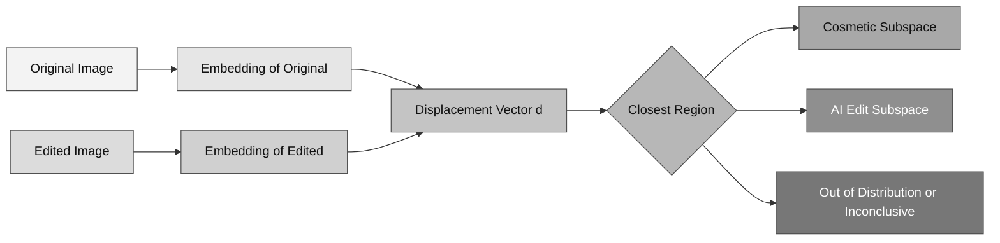
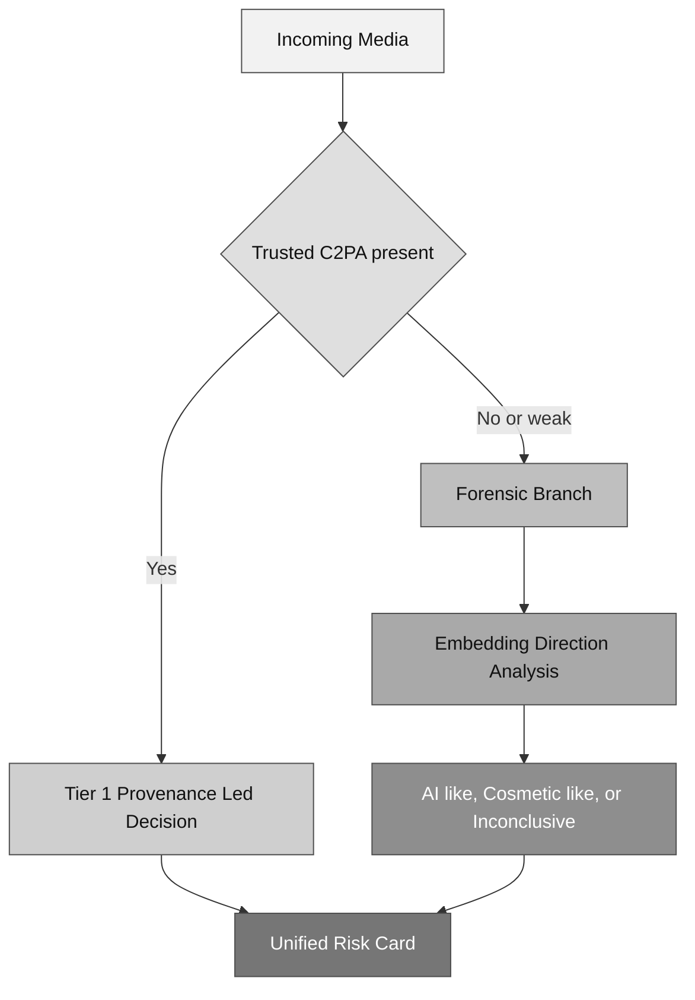

# Aura Research Note: Embedding Directions for Real, Cosmetic, and AI Edits

**Date:** February 10, 2026  
**Status:** Working draft

> [!IMPORTANT]
> This note explores whether edit displacements in embedding space carry stable forensic structure.

## Why we are exploring this

Our current forensic path mostly asks: "What is this image right now?"  
This idea adds a second question: **"How did it move in representation space?"**

If we embed an original image and an edited version, we can define:

`delta = E(edited) - E(original)`

The central question is whether these `delta` vectors carry consistent structure:

- one family for cosmetic edits,
- another family for AI edits,
- and possibly a stable region for unedited images.

This is conceptually similar to meaningful directions in text embedding spaces.

> [!WARNING]
> At this stage, this is a theory-driven hypothesis. We must verify it with controlled experiments before making any accuracy claims.

---

## High-level feasibility

The idea is feasible and worth pursuing.  
The main refinement is that we should not expect a single universal "AI direction." A more realistic target is:

- **direction families**, or
- **learned edit subspaces** conditioned on content/domain.

In short: strong idea, but the geometry is likely structured and local rather than one global axis.

<table>
  <thead>
    <tr>
      <th>Current confidence level</th>
      <th>What is established</th>
      <th>What still must be verified</th>
    </tr>
  </thead>
  <tbody>
    <tr>
      <td>Theoretical feasibility: high</td>
      <td>There is a plausible geometric signal in embedding displacements</td>
      <td>Whether the signal is accurate, stable, and robust enough for real use</td>
    </tr>
  </tbody>
</table>

<table>
  <thead>
    <tr>
      <th>Dimension</th>
      <th>Assessment</th>
      <th>Reason</th>
    </tr>
  </thead>
  <tbody>
    <tr>
      <td>Technical feasibility</td>
      <td>High</td>
      <td>Embedding extraction + simple classifiers are immediately available</td>
    </tr>
    <tr>
      <td>Data feasibility</td>
      <td>Medium-High</td>
      <td>Paired data can be curated internally with controlled edits</td>
    </tr>
    <tr>
      <td>Research novelty</td>
      <td>High</td>
      <td>Direction/subspace framing is interpretable and hybrid-trust compatible</td>
    </tr>
  </tbody>
</table>

---

## Intuition in one figure

---

## Research framing that fits Aura

To keep this scientifically clean, we frame the method around three objects:

- `E(x)`: embedding model output,
- `d = E(x') - E(x)`: edit displacement,
- subspaces:
  - `S_cosmetic` for cosmetic edits,
  - `S_ai` for AI edits.

Then we score each sample using projection features:

- `score_cosmetic = ||Proj(d, S_cosmetic)||`
- `score_ai = ||Proj(d, S_ai)||`
- `residual = ||d - Proj(d, S_cosmetic U S_ai)||`

The residual is important: it gives a principled way to abstain when edits are unfamiliar.

> [!NOTE]
> In practice we should evaluate both linear subspace models and nonlinear decision heads; whichever calibrates better under stress should be preferred.

---

## What makes this scientifically useful

1. **Interpretability**  
   We can inspect displacement structure instead of relying on opaque logits only.
2. **Calibration support**  
   Residual distance supports uncertainty-aware decisions.
3. **Fit with Aura policy**  
   It naturally supports "inconclusive" rather than forced overconfident labels.
4. **Hybrid compatibility**  
   This plugs into the forensic branch when provenance is absent.

---

## Challenges we should expect

- Cosmetic and AI edits can overlap in modern pipelines.
- Embedding behavior changes with domain (faces, documents, landscapes).
- Compression and platform transforms can distort the displacement geometry.
- Public labels are often noisy for "cosmetic vs AI" boundaries.

These are manageable if we design the dataset and evaluation carefully.

<table>
  <thead>
    <tr>
      <th>Challenge</th>
      <th>Failure risk</th>
      <th>Mitigation</th>
    </tr>
  </thead>
  <tbody>
    <tr>
      <td>Cosmetic/AI overlap</td>
      <td>Boundary confusion</td>
      <td>Introduce mixed-edit label + abstention zone</td>
    </tr>
    <tr>
      <td>Domain shift</td>
      <td>Poor generalization</td>
      <td>Domain-stratified evaluation and holdout splits</td>
    </tr>
    <tr>
      <td>Compression/transcoding</td>
      <td>Direction drift</td>
      <td>Stress-test under platform-like transforms</td>
    </tr>
    <tr>
      <td>Noisy labels</td>
      <td>Miscalibrated confidence</td>
      <td>Curated paired edits with strict labeling rules</td>
    </tr>
  </tbody>
</table>

---

## Minimal experiment plan (first 2-3 weeks)

<table>
  <thead>
    <tr>
      <th>Step</th>
      <th>What we do</th>
      <th>What we learn</th>
    </tr>
  </thead>
  <tbody>
    <tr>
      <td>1. Representation check</td>
      <td>Build triplets and visualize embeddings + displacement vectors</td>
      <td>Whether edit classes form visible structure</td>
    </tr>
    <tr>
      <td>2. Baseline modeling</td>
      <td>Train linear probe, SVM, and small MLP on multiple feature sets</td>
      <td>Raw vs displacement feature value</td>
    </tr>
    <tr>
      <td>3. Subspace model</td>
      <td>Learn <code>S_cosmetic</code> and <code>S_ai</code> with PCA/PLS</td>
      <td>Interpretability and abstention behavior</td>
    </tr>
    <tr>
      <td>4. Robustness + calibration</td>
      <td>Apply recompression/resize/recapture stress tests</td>
      <td>Real-world reliability and confidence quality</td>
    </tr>
  </tbody>
</table>

---

## How this fits into the Aura pipeline

---

## Next concrete deliverables

- A paired mini-dataset specification (labeling rules + edit taxonomy).
- A reproducible notebook/script for displacement extraction and baselines.
- A short report with:
  - separability visuals,
  - baseline metrics,
  - uncertainty behavior.

If these first results are positive, this can become one of Aura's strongest technical contributions.

> [!IMPORTANT]
> We should treat all current claims as provisional until we complete theoretical and empirical validation with reproducible benchmarks.

> [!TIP]
> For the first meeting checkpoint, one UMAP plot + one calibration curve + one confusion matrix is usually enough to show progress convincingly.

---

## Sources

- Edit representation in CLIP-like spaces:
  - `https://openaccess.thecvf.com/content/ICCV2025/papers/Wang_EditCLIP_Representation_Learning_for_Image_Editing_ICCV_2025_paper.pdf`
  - `https://arxiv.org/pdf/2210.03919`
- CLIP-based AI image detection:
  - `https://openaccess.thecvf.com/content/CVPR2024W/WMF/html/Cozzolino_Raising_the_Bar_of_AI-generated_Image_Detection_with_CLIP_CVPRW_2024_paper.html`
  - `https://arxiv.org/abs/2505.10664`
- Contrastive forensics representation learning:
  - `https://arxiv.org/abs/2210.02182`
  - `https://arxiv.org/abs/2211.10922`
- Integration context:
  - `https://c2pa.org/`
  - `https://spec.c2pa.org/`

