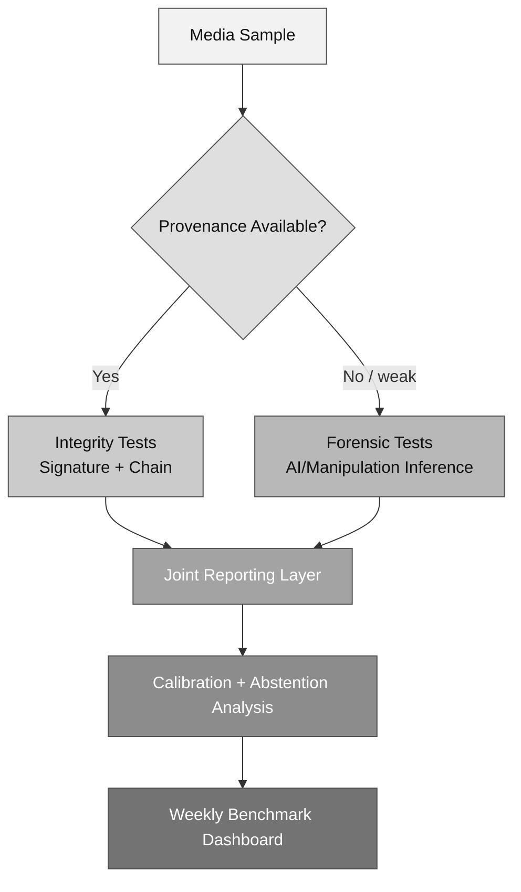

# Aura Evaluation and Benchmark Protocol (2026)

**Date:** February 10, 2026  
**Status:** Working draft

> [!IMPORTANT]
> We evaluate deterministic provenance claims and probabilistic forensic claims separately, then report them together.

## Why this protocol matters

At this stage, Aura needs disciplined evidence more than new feature lists.  
This protocol is our shared testing contract: what we measure, how we measure it, and what counts as progress.

We evaluate two different kinds of claims:

- **Deterministic claims** (provenance and signature integrity),
- **Probabilistic claims** (forensic and semantic inference).

Keeping these separate prevents accidental overclaiming.

---

## Evaluation structure

---

## Data strategy

We use a mixed matrix so we do not overfit to one benchmark style.

### Public datasets (baseline coverage)

- FaceForensics++
- DFDC (frames extracted where needed)
- GenImage
- Deepfake-Eval-2024
- OpenFake

### Aura internal set (critical)

We should maintain a private paired set with:

- signed captures from our prototype path,
- cosmetic edits (crop, tone, denoise),
- AI edits (insert, remove, relight, inpaint),
- provenance attacks (manifest stripping, sidecar mismatch).

Without this internal set, we cannot convincingly validate the full Aura chain.

---

## Benchmark tasks

<table>
  <thead>
    <tr>
      <th>Task</th>
      <th>Input/Output</th>
      <th>Primary metrics</th>
    </tr>
  </thead>
  <tbody>
    <tr>
      <td>Task A: Provenance integrity</td>
      <td>Input: media + manifest/sidecar Output: valid / invalid / incomplete</td>
      <td>True acceptance, false acceptance, manifest-stripping recall</td>
    </tr>
    <tr>
      <td>Task B: Synthetic detection</td>
      <td>Input: weak/missing provenance media Output: authentic-like / synthetic-like / inconclusive</td>
      <td>AUC-ROC, macro/weighted F1, abstention-adjusted accuracy</td>
    </tr>
    <tr>
      <td>Task C: Manipulation typing</td>
      <td>Output classes: authentic, cosmetic-only, AI insertion, AI removal/inpainting, mixed</td>
      <td>Macro-F1, per-class recall, confusion profile</td>
    </tr>
    <tr>
      <td>Task D: Calibration quality</td>
      <td>Confidence behavior across domains</td>
      <td>ECE, Brier score, reliability curves</td>
    </tr>
  </tbody>
</table>

---

## Robustness suite

Each sample gets evaluated in three stress buckets.

### 1) Non-adversarial transform stress

- JPEG recompression ladder,
- resize/downscale/upscale,
- social-platform transcodes,
- screenshot recapture.

### 2) Adversarial stress

- metadata stripping and reattachment,
- anti-forensic perturbations,
- watermark obfuscation,
- mixed human+AI edit chains.

### 3) Domain shift stress

- low light,
- high ISO noise,
- motion blur,
- multilingual text overlays.

<table>
  <thead>
    <tr>
      <th>Stress bucket</th>
      <th>Examples</th>
      <th>Why we need it</th>
    </tr>
  </thead>
  <tbody>
    <tr>
      <td>Non-adversarial transform</td>
      <td>Recompression, resize, platform transcode, screenshot recapture</td>
      <td>Replicates ordinary social-media and messaging pipelines</td>
    </tr>
    <tr>
      <td>Adversarial stress</td>
      <td>Metadata attacks, anti-forensic perturbations, watermark obfuscation</td>
      <td>Measures resistance to deliberate evasion</td>
    </tr>
    <tr>
      <td>Domain shift</td>
      <td>Low light, high ISO, blur, multilingual overlays</td>
      <td>Avoids overfitting to clean benchmark conditions</td>
    </tr>
  </tbody>
</table>

> [!WARNING]
> A model that performs well only on clean benchmark images is not deployment-ready.

---

## What we track each week

<table>
  <thead>
    <tr>
      <th>KPI</th>
      <th>Target</th>
      <th>Interpretation</th>
    </tr>
  </thead>
  <tbody>
    <tr>
      <td>Crypto FAR (invalid signatures accepted)</td>
      <td>&lt;= 0.1%</td>
      <td>Lower is better; this is core trust safety</td>
    </tr>
    <tr>
      <td>Tier-2 AUC (in-the-wild)</td>
      <td>&gt;= 0.90</td>
      <td>Separation quality for forensic branch</td>
    </tr>
    <tr>
      <td>Strict-mode abstention rate</td>
      <td>25-45%</td>
      <td>Healthy uncertainty in high-stakes mode</td>
    </tr>
    <tr>
      <td>ECE (strict mode)</td>
      <td>&lt;= 0.04</td>
      <td>Confidence should match actual correctness</td>
    </tr>
  </tbody>
</table>

We also report all metrics by source type, quality band, region/language, and manipulation class.

---

## Reproducibility rules

Each run must store:

- model artifact hash,
- dataset version ID,
- code commit SHA,
- threshold configuration.

Outputs should be saved as immutable bundles (metrics JSON + plots + confusion matrices).  
For learning-based methods, we report mean and confidence interval over at least 3 seeds.

---

## Short-term research extensions

1. **Provenance-fallback delta**  
   Measure quality gap between provenance-aware mode and forensic-only mode.
2. **Human + model study**  
   Compare analyst decisions with no output, label-only output, and full evidence card.
3. **Trust-debt tracking**  
   Monitor unresolved uncertainty by source over time.

---

## Sources

- C2PA / Content Authenticity:
  - `https://c2pa.org/`
  - `https://spec.c2pa.org/`
  - `https://opensource.contentauthenticity.org/`
- Benchmark references:
  - `https://ieeexplore.ieee.org/document/9010912` (FaceForensics++)
  - `https://arxiv.org/abs/2503.02857` (Deepfake-Eval-2024)
  - `https://arxiv.org/abs/2509.09495` (OpenFake reference)
- NIST synthetic-content risk guidance:
  - `https://www.nist.gov/publications/reducing-risks-posed-synthetic-content-overview-technical-approaches-digital-content`
  - `https://www.nist.gov/publications/artificial-intelligence-risk-management-framework-ai-rmf-10`

