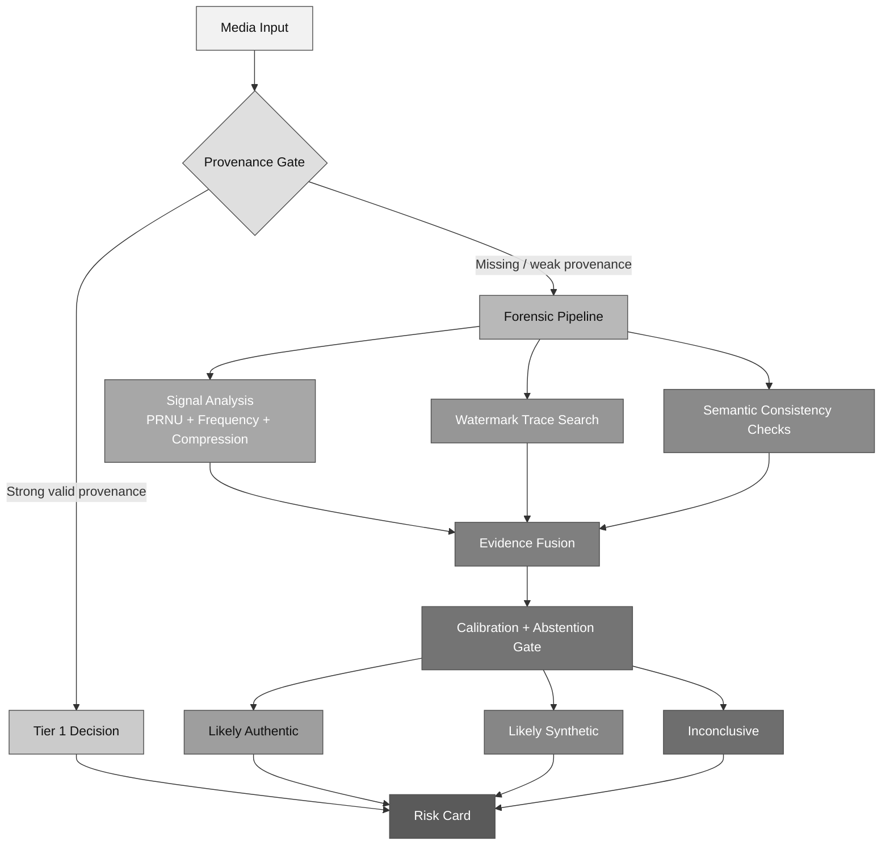

# Aura Forensic Risk Engine v2 (FRE-v2)

**Date:** February 10, 2026  
**Status:** Working draft

> [!IMPORTANT]
> FRE-v2 is designed to combine evidence conservatively and abstain when evidence is insufficient.

## Why this update exists

Aura already has a good conceptual split:

- deterministic trust from cryptographic provenance,
- probabilistic trust from forensic analysis.

What we needed was a smoother, implementable bridge between the two.  
FRE-v2 is that bridge: a practical way to combine evidence, calibrate confidence, and abstain when we should.

---

## Core idea

Instead of forcing one model score to answer everything, we combine three evidence streams:

1. **Provenance evidence**  
   signature validity, chain integrity, issuer trust.
2. **Forensic evidence**  
   noise and frequency traces, watermark-like signals, manipulation artifacts.
3. **Semantic evidence**  
   coherence checks (shadows, reflections, scene logic, text-image consistency).

The output is not just a label. It is a label plus an evidence card that explains why.

<table>
  <thead>
    <tr>
      <th>Evidence stream</th>
      <th>What it captures</th>
      <th>Typical failure mode</th>
      <th>Mitigation</th>
    </tr>
  </thead>
  <tbody>
    <tr>
      <td>Provenance</td>
      <td>Signature validity, chain, issuer trust</td>
      <td>Metadata stripping or weak issuers</td>
      <td>Fallback to forensic branch + issuer memory</td>
    </tr>
    <tr>
      <td>Forensic</td>
      <td>Noise/frequency/watermark-like traces</td>
      <td>Adversarial perturbation or heavy transcode</td>
      <td>Stress-calibrated thresholds + contradiction checks</td>
    </tr>
    <tr>
      <td>Semantic</td>
      <td>Scene coherence and plausibility</td>
      <td>Subjective ambiguity</td>
      <td>Use as advisory signal, never sole red-label trigger</td>
    </tr>
  </tbody>
</table>

---

## Architecture

---

## Scoring and abstention

We keep the scoring explicit:

- `P_prov`: provenance confidence in authenticity
- `P_forensic`: probability of synthetic/manipulated traces
- `P_sem`: semantic anomaly probability

`risk_score = w1*(1 - P_prov) + w2*P_forensic + w3*P_sem`

Conservative default weights:

- `w1=0.45`, `w2=0.40`, `w3=0.15`

Decision zones:

- `risk_score <= 0.10` -> likely authentic
- `risk_score >= 0.90` -> likely synthetic
- otherwise -> inconclusive

The middle band is intentional. It protects us from false certainty.

<table>
  <thead>
    <tr>
      <th>Risk score band</th>
      <th>Decision</th>
      <th>Default action</th>
    </tr>
  </thead>
  <tbody>
    <tr>
      <td><code>&lt;= 0.10</code></td>
      <td>Likely authentic</td>
      <td>Return confidence + evidence card</td>
    </tr>
    <tr>
      <td><code>&gt;= 0.90</code></td>
      <td>Likely synthetic/manipulated</td>
      <td>Return confidence + escalation hint</td>
    </tr>
    <tr>
      <td><code>0.10 - 0.90</code></td>
      <td>Inconclusive</td>
      <td>Route to human review</td>
    </tr>
  </tbody>
</table>

> [!WARNING]
> The middle zone is a feature, not a bug. Removing it usually increases harmful false positives.

---

## What is new in this version

### 1) Trust Debt

A measure of unresolved uncertainty:

- low trust debt: strong provenance + coherent forensics,
- high trust debt: weak provenance + ambiguous evidence.

This helps prioritize human review and escalation.

### 2) Contradiction alerts

We explicitly flag disagreement between evidence streams, for example:

- valid provenance but strong synthetic forensic cues.

This is useful against provenance abuse and piggybacking attacks.

### 3) Source reliability memory

We store historical behavior for issuers and devices:

- repeated contradictions,
- frequent stripped metadata,
- unstable signal quality.

This gives us better priors over time.

<table>
  <thead>
    <tr>
      <th>New component</th>
      <th>Purpose</th>
      <th>Practical impact</th>
    </tr>
  </thead>
  <tbody>
    <tr>
      <td>Trust Debt</td>
      <td>Quantify unresolved uncertainty</td>
      <td>Prioritizes review queues</td>
    </tr>
    <tr>
      <td>Contradiction alerts</td>
      <td>Flag strong disagreement across evidence streams</td>
      <td>Catches provenance piggybacking patterns</td>
    </tr>
    <tr>
      <td>Source reliability memory</td>
      <td>Track issuer/device history over time</td>
      <td>Improves calibration and triage quality</td>
    </tr>
  </tbody>
</table>

---

## Recommended output shape

We should keep one stable analyst-facing response schema:

- trust tier,
- risk label,
- confidence + risk score,
- top evidence,
- explicit limitations,
- recommended action.

The limitations field is not cosmetic; it is critical for trust.

---

## Implementation notes

### Backend

- Python service for iteration:
  - `fastapi`, `pydantic`,
  - `numpy`, `opencv-python`, `scikit-image`,
  - optional `torch`,
  - `c2pa-python` adapter.
- High-throughput path:
  - `c2pa-rs` verifier service + Python workers.

### UI

- Provenance rendering through `c2pa-js` / `@contentauth/react`.
- Fixed evidence card with:
  - reasons,
  - confidence,
  - limitations,
  - escalation recommendation.

### Calibration + monitoring

- `mlflow` for experiments,
- `evidently` for drift and reliability tracking.

> [!TIP]
> For weekly updates, report one reliability plot alongside accuracy; calibration quality is central to trust-facing systems.

---

## Immediate research experiments

1. provenance-only vs forensic-only vs hybrid ablation,
2. attack stress tests (metadata stripping, recompression, anti-forensic perturbations),
3. human decision study with and without evidence cards,
4. threshold tuning by domain (journalism vs moderation).

---

## Sources

- C2PA ecosystem and SDKs:
  - `https://c2pa.org/`
  - `https://spec.c2pa.org/`
  - `https://opensource.contentauthenticity.org/docs/c2pa-python/`
  - `https://opensource.contentauthenticity.org/docs/rust-sdk/`
  - `https://opensource.contentauthenticity.org/docs/js-sdk/getting-started/overview/`
- SynthID references:
  - `https://www.deepmind.com/synthid`
  - `https://blog.google/innovation-and-ai/products/google-synthid-ai-content-detector/`
  - `https://docs.cloud.google.com/vertex-ai/generative-ai/docs/image/verify-watermark`
- Forensic references:
  - `https://github.com/polimi-ispl/prnu-python`
  - `https://grip-unina.github.io/noiseprint/`
- Risk/governance references:
  - `https://www.nist.gov/publications/artificial-intelligence-risk-management-framework-ai-rmf-10`
  - `https://www.nist.gov/publications/reducing-risks-posed-synthetic-content-overview-technical-approaches-digital-content`

