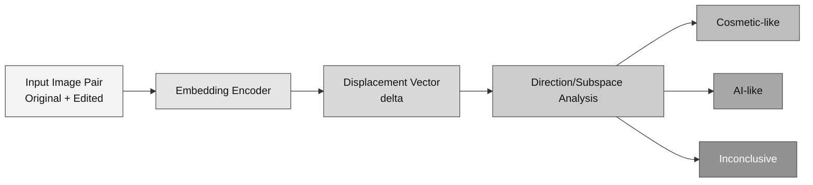

# Aura Meeting Brief

**Date:** February 10, 2026  
**Use:** A quick walkthrough

## What we finished

We reorganized the work into three focused research documents:

<table>
  <thead>
    <tr>
      <th>Document</th>
      <th>Main contribution</th>
      <th>Why it matters right now</th>
    </tr>
  </thead>
  <tbody>
    <tr>
      <td><code>Aura-Forensic-Risk-Engine-v2.md</code></td>
      <td>Hybrid trust engine (provenance + forensics + semantics)</td>
      <td>Turns high-level trust ideas into an implementable pipeline</td>
    </tr>
    <tr>
      <td><code>Aura-Evaluation-Benchmark-Protocol-2026.md</code></td>
      <td>Evaluation contract (quality, robustness, calibration, abstention)</td>
      <td>Prevents overclaiming and makes progress measurable</td>
    </tr>
    <tr>
      <td><code>Aura-Embedding-Directions-Feasibility-2026.md</code></td>
      <td>New edit-displacement method in embedding space</td>
      <td>Potentially novel research contribution for publication</td>
    </tr>
  </tbody>
</table>

## Core new idea (from this session)

Instead of only classifying a final image, we model the **edit displacement**:

`delta = E(edited) - E(original)`

Working hypothesis:

- cosmetic and AI edits occupy different directional regions (or subspaces),
- this gives us better interpretability than a single opaque classifier score,
- and it fits Aura's rule of conservative decisions when evidence is weak.

## Why this matters for Aura

- It strengthens novelty: we move beyond generic deepfake detection.
- It fits the hybrid trust model:
  - cryptographic proof when provenance is available,
  - calibrated forensic inference when provenance is missing.
- It gives us a clean, publishable experimental path.

## Feasibility in one line

**Feasible and promising**, but we should expect **families of directions**, not a single universal axis.

> [!NOTE]
> The strongest framing is "learned edit subspaces" rather than "one AI direction."

## Immediate next steps (this week)

<table>
  <thead>
    <tr>
      <th>Step</th>
      <th>Action</th>
      <th>Deliverable</th>
    </tr>
  </thead>
  <tbody>
    <tr>
      <td>1</td>
      <td>Build minimal pipeline (CLIP embeddings + displacement + baseline classifiers)</td>
      <td>Runnable baseline script/notebook</td>
    </tr>
    <tr>
      <td>2</td>
      <td>Curate paired mini-dataset (real→cosmetic, real→AI)</td>
      <td>Labeled starter dataset spec</td>
    </tr>
    <tr>
      <td>3</td>
      <td>Evaluate and summarize first evidence</td>
      <td>Plots + AUC/F1 + calibration/abstention notes</td>
    </tr>
  </tbody>
</table>

## Figure: where the new idea fits

## One-sentence meeting takeaway

**Today we turned Aura's recent strategy work into a tighter research program and introduced a concrete, testable embedding-direction method that may become a central contribution.**

